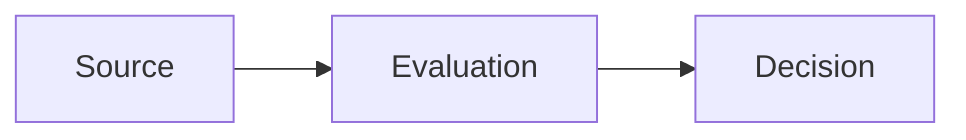
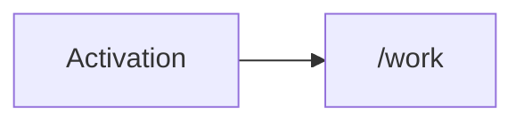
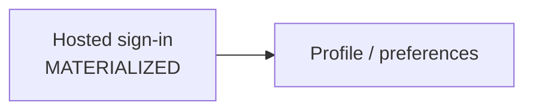
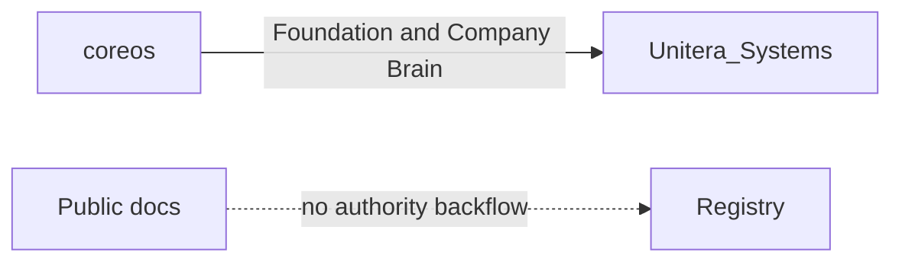
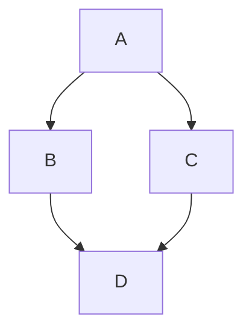
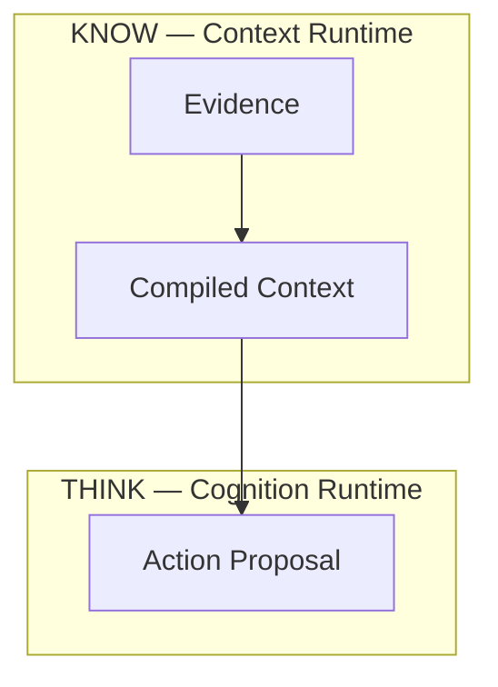
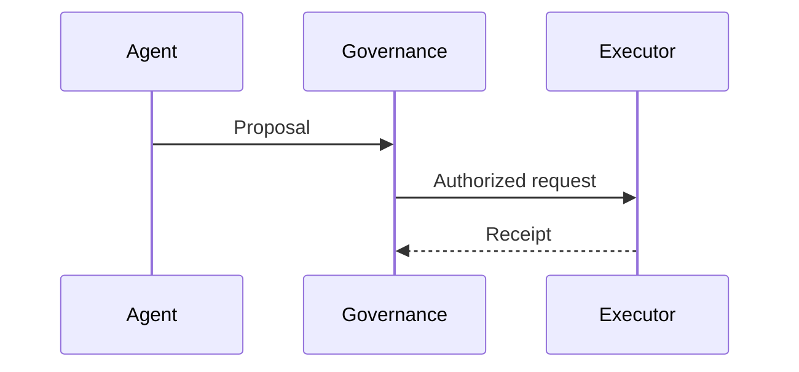

# Mermaid on GitHub — gültige Syntax / valid syntax

> Repository convention for diagrams that must render in GitHub Markdown
> (README, `docs/**/*.md`, Issues, Pull Requests, Discussions, Wikis).

Official GitHub documentation:

- Deutsch: [Diagramme erstellen](https://docs.github.com/de/get-started/writing-on-github/working-with-advanced-formatting/creating-diagrams)
- English: [Creating diagrams](https://docs.github.com/en/get-started/writing-on-github/working-with-advanced-formatting/creating-diagrams)

Mermaid language reference (not GitHub-specific): [mermaid.js](https://mermaid.js.org/)

Check the Mermaid version currently used by GitHub:

```mermaid
info
```

---

## 1. Fence — the only supported wrapper

GitHub renders a diagram only when the fenced code block uses the language
identifier `mermaid`. Use backtick fences, as in the official docs.

````markdown

````

Rules:

- Opening fence: three backticks immediately followed by `mermaid` (no space).
- Closing fence: three backticks on their own line.
- Do not wrap Mermaid in a generic ` ```text ` or indented code block.
- Do not use `~~~mermaid` in this repository. GitHub can parse tilde fences,
  but the published GitHub syntax and this repo standardize on backticks.
- Do not put `%%{init: ...}%%` configuration, `click` handlers, or custom
  Mermaid themes in public docs. GitHub uses a fixed Mermaid build and does
  not honor author configuration.

Also supported by GitHub, but not used here: `geojson`, `topojson`, `stl`.

---

## 2. Diagram types used in this repository

| Type | When to use |
| --- | --- |
| `flowchart LR` | Lifecycle or cross-boundary movement |
| `flowchart TB` | Layered architecture |
| `sequenceDiagram` | Actor order, request/response, enrollment |

GitHub also renders other Mermaid types (class, state, pie, git, er, …). Prefer
the three forms above so architecture meaning stays reviewable in diffs.

---

## 3. Labels that GitHub parses safely

Unquoted square-bracket labels are treated as Mermaid shape syntax.

| Syntax | Meaning |
| --- | --- |
| `A[text]` | rectangle |
| `A[/text/]` | parallelogram |
| `A[/text]` | **invalid / mis-parsed** if `text` starts with `/` |

Therefore a product path such as `/work` must be a quoted label:



Quote a node or subgraph title when the label contains any of:

- `/` `\` `&` `()` `<>` `,` `;` `#`
- HTML line breaks
- leading `/` (paths)

Use `<br>` inside the quoted string. Do not use `<br/>`.



Edge labels with spaces or punctuation belong in `|...|`:



`&` in a label must be quoted (`["Policy & Effective Autonomy"]`). Unquoted
`&` can collide with Mermaid class syntax.

---

## 4. Flowchart skeleton (GitHub example, adapted)

From the official GitHub page the minimum valid flowchart is:



This repository prefers the newer `flowchart` keyword and explicit node IDs:


Subgraphs name a trust or ownership boundary. Give them a stable ID and a
quoted title when the title has spaces or punctuation:



Do not use reserved words such as `end`, `subgraph`, `graph`, or `flowchart`
as node IDs.

---

## 5. Sequence diagrams



- `->>` request / call
- `-->>` response / receipt
- Participant aliases may contain spaces and `/`. Keep message text free of
  raw `:` confusion by putting the actor IDs first: `A->>G: text`.

---

## 6. Repository style (meaning, not color)

Aligned with `docs/de/style/documentation-and-diagrams.md` and
`docs/en/style/documentation-and-diagrams.md`:

- Solid `-->`: normal data or control progression.
- Dotted `-.->`: explanatory/reference link or an explicitly labeled
  prohibition of authority backflow.
- Subgraphs: KNOW / THINK / ACT or a clear trust/ownership domain.
- Do not encode authority, risk, or maturity with color alone.
- German and English editions of a diagram must keep the same node IDs and
  topology; only label language may change.

---

## 7. Checklist before merging a diagram

1. Fence is ` ```mermaid ` … ` ``` `.
2. First line is `flowchart LR`, `flowchart TB`, or `sequenceDiagram`.
3. Every `/path`, `<br>`, `&`, and slash-containing phrase is inside `"..."`.
4. Line breaks are `<br>`, never `<br/>`.
5. No `%%{init`, no `click`, no `classDef` used as the only meaning carrier.
6. The German and English copies still share topology and node IDs.
7. Preview the file on GitHub (or a PR Files view). If GitHub shows a syntax
   error instead of a diagram, the fence or a label shape is wrong.

---

## 8. Official GitHub notes (abridged)

Quoted from the GitHub docs linked above:

- Diagrams can be created in issues, discussions, pull requests, wikis, and
  Markdown files.
- Create the diagram in a fenced code block with the language identifier
  `mermaid`.
- Mermaid is a Markdown-inspired tool for flowcharts, sequence diagrams, and
  further diagram types.
- Third-party Mermaid plugins can conflict with GitHub’s built-in renderer.
- GitHub does not expose a custom Mermaid configuration to authors.
