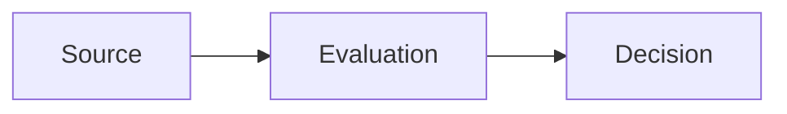
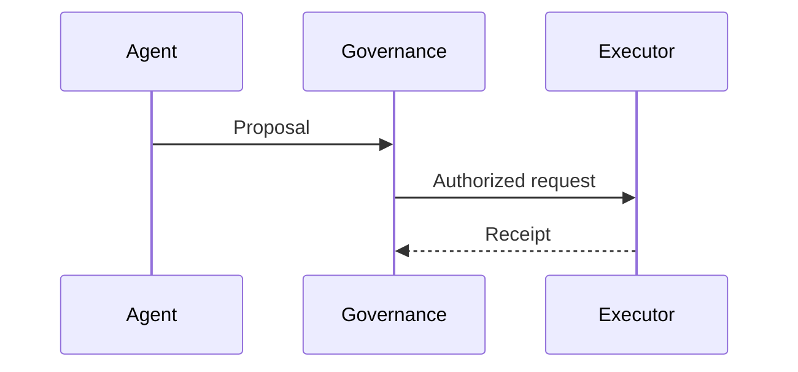

# Mermaid rules — GitHub-native, binding

**Status:** repository-local publication convention  
**Authority:** applies only to this public projection repository  
**Renderer:** GitHub-native Mermaid in Markdown files, issues, pull requests, discussions, and wikis  
**Canonical renderer documentation:** [Creating Mermaid diagrams on GitHub](https://docs.github.com/get-started/writing-on-github/working-with-advanced-formatting/creating-diagrams#creating-mermaid-diagrams)

This file is the binding diagram contract for `unitera_public_docs`. Language editions restated the same rules in:

- [Dokumentations- und Diagrammkonventionen](docs/de/style/documentation-and-diagrams.md)
- [Documentation & diagram conventions](docs/en/style/documentation-and-diagrams.md)

## Binding rules

1. Use a fenced code block with the language identifier `mermaid`. Prefer backtick fences, as documented by GitHub:

   ````markdown
   ```mermaid
   flowchart LR
       A[Source] --> B[Evaluation]
   ```
   ````

   Do not use `~~~mermaid` in this repository. Tilde fences are reserved for non-diagram example blocks (`~~~text`) so diagram fences stay identical to the GitHub documentation.

2. Put only Mermaid syntax inside the fence. Do not wrap the diagram in quotes, HTML, or another language identifier (` ```js `, ` ```text `).

3. Use diagram types that GitHub-native Mermaid can render. In this repository the allowed types are:

   - `flowchart LR` for lifecycle or cross-boundary movement
   - `flowchart TB` for layered architecture
   - `sequenceDiagram` when actor order and request/response semantics matter

   Do not introduce `graph` (legacy), `classDef` color semantics as the sole meaning carrier, `click` handlers, `%%{init: ...}%%` theme overrides, or third-party Mermaid plugins.

4. Quote any node or subgraph label that contains a character Mermaid treats as shape or syntax, especially `/`, `\\`, `<`, `>`, `#`, `;`, `"`, parentheses, or HTML line breaks:

   ```mermaid
   flowchart LR
       A["Hosted sign-in<br>MATERIALIZED"] --> B["/work"]
   ```

   Unquoted `X[/work]` is **invalid** on GitHub: `[/ ...]` starts parallelogram shape syntax and breaks the diagram.

5. Use `<br>` for line breaks inside quoted labels. Do not use `<br/>` or raw Markdown inside a node label.

6. Keep node IDs simple: `A`, `KNOW`, `WorkOrder`. Never use reserved words `end`, `subgraph`, `graph`, or `flowchart` as a node ID.

7. Encode meaning with structure and labels, not color:

   - solid arrow `-->`: normal data or control progression
   - dotted arrow `-.->`: explanatory/reference relationship, or an explicitly labeled prohibition of authority backflow
   - subgraphs: KNOW / THINK / ACT or a clear trust/ownership domain

8. Check the GitHub-supported Mermaid version with:

   ```mermaid
   info
   ```

   Features newer than GitHub’s bundled Mermaid version must not be used.

9. Preview the file on GitHub (or in a GitHub pull request) before merging. A local plugin is not the renderer of record; GitHub’s warning applies: third-party Mermaid plugins can show a diagram that GitHub itself rejects.

## Minimal valid examples





## Review checklist

- [ ] Fence is exactly ` ```mermaid ` … ` ``` `
- [ ] First line is `flowchart LR`, `flowchart TB`, or `sequenceDiagram`
- [ ] Labels with `/`, `<br>`, or other syntax characters are double-quoted
- [ ] Product path `/work` is written `["/work"]`, never `[/work]`
- [ ] No `click`, `init`, theme CSS, or color-only authority encoding
- [ ] German and English editions keep the same topology even when labels differ
