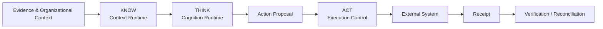
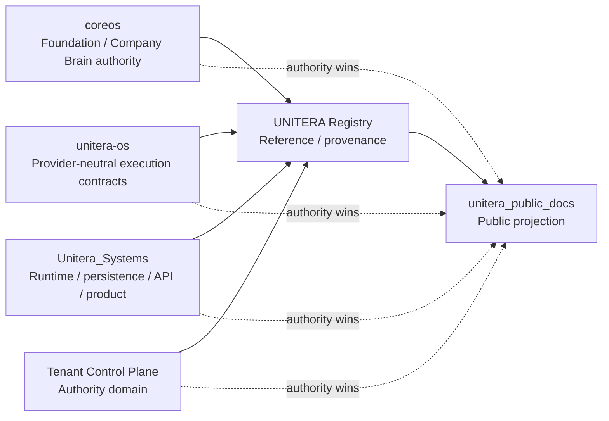

# UNITERA — Public Architecture & Documentation

> **Public projection — not an authority source.**
>
> This repository explains and visualizes UNITERA for external readers. It does not create, replace, or supersede canonical contracts, owner decisions, runtime authority, Registry state, or Source-of-Truth artifacts.

UNITERA is a customizable AI operating system for company-specific agentic work. Its architectural center is **governed execution**: AI may analyze, draft, plan, and propose actions, while binding business effects remain subject to explicit authority, policy, human control where required, grants, execution boundaries, receipts, verification, and audit evidence.

## Core architecture

**Rule:** more context, more compute, or more model capability never creates more authority.

## Repository role

The Registry **references authority; it does not create authority**. This repository is one step further downstream: it is a human-readable projection of verified source material.

## Reading path

1. [System overview](docs/architecture/system-overview.md)
2. [Authority and Source-of-Truth model](docs/architecture/authority-and-source-model.md)
3. [KNOW / THINK / ACT](docs/architecture/know-think-act.md)
4. [Tenant, Discovery & Company Brain](docs/product/tenant-discovery-company-brain.md)
5. [Governed effect lifecycle](docs/runtime/governed-effect.md)
6. [Registry and publication flow](docs/registry/source-to-publication.md)
7. [Current public status](docs/status/current-state.md)
8. [Executive overview](docs/presentation/executive-overview.md)
9. [Documentation & diagram conventions](docs/style/documentation-and-diagrams.md)
10. [Source basis](docs/reference/source-basis.md)
11. [Glossary](docs/reference/glossary.md)

## Publication labels

| Label | Meaning |
|---|---|
| **ESTABLISHED** | Stable architectural or authority boundary supported by owner/source material. |
| **MATERIALIZED** | Implemented in the owning repository/runtime surface. |
| **CANDIDATE** | Source-worthy direction, not yet canonical authority. |
| **OPEN** | Intentionally unresolved or awaiting adoption/verification. |
| **PUBLIC PROJECTION** | Explanatory representation only; never normative by itself. |

## Non-negotiable semantic boundaries

- Evidence ≠ Truth
- Interpretation ≠ Authority
- Claim ≠ Active Truth
- Approval ≠ Activation
- Context ≠ Permission
- Capability availability ≠ Permission
- Approval ≠ Capability Grant
- Receipt ≠ Verification
- Locality ≠ Trust
- Model capability ≠ Authority

## Public claim posture

This repository describes architecture and verified implementation state. It must not imply automatic regulatory compliance, certification, production activation, customer proof, or unrestricted autonomous execution unless those claims are independently supported by the relevant authority and evidence surfaces.

## Source discipline

Every substantive document should identify its status and source basis. If this repository conflicts with an owning source, **the owning source wins**. Public documentation is updated only after source/authority reconciliation; it must never be used to back-propagate authority into owner repositories.
