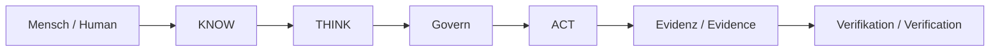

# UNITERA — Public Architecture & Documentation

> **Öffentliche Projektion — keine Autoritätsquelle.**
>
> **Public projection — not an authority source.**

UNITERA verbindet Organisationskontext, KI-gestützte Kognition, menschliche
Entscheidungsfähigkeit und kontrollierte Wirkung. Mehr Kontext oder
Modellfähigkeit erzeugt dabei niemals mehr Autorität.

UNITERA connects organizational context, AI-assisted cognition, human agency,
and governed effect. More context or model capability never creates more
authority.

## Sprache / Language

- [Deutsch](docs/de/README.md)
- [English](docs/en/README.md)

## Schnellstart / Quick start

- [UNITERA in 5 Minuten](docs/de/getting-started/unitera-in-5-minutes.md)
- [UNITERA in 5 minutes](docs/en/getting-started/unitera-in-5-minutes.md)
- [Funktionen, Capabilities und Use Cases](docs/de/status/capability-use-case-matrix.md)
- [Functions, capabilities and use cases](docs/en/status/capability-use-case-matrix.md)

## Öffentliche Aussage / Public claim

*Conceptual public projection — not deployment, service, repository, protocol or security topology.*

Die Dokumentation erklärt Prinzipien, Produktverhalten und grobe Reifegrade.
Sie veröffentlicht keine rekonstruierbare interne Topologie. Details zur Grenze
stehen in der [deutschen](docs/de/reference/public-disclosure-policy.md) und
[englischen](docs/en/reference/public-disclosure-policy.md) Disclosure-Policy.

This documentation explains principles, product behavior, and coarse maturity.
It does not publish reconstructable internal topology. See the
[German](docs/de/reference/public-disclosure-policy.md) and
[English](docs/en/reference/public-disclosure-policy.md) disclosure policies.
