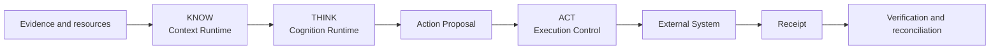
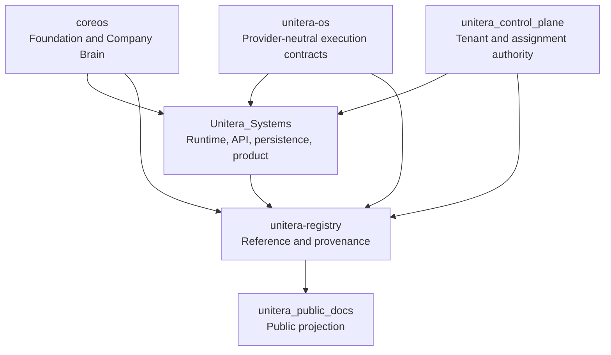

# UNITERA — Public Architecture & Documentation

> **Public projection — not an authority source.**
>
> This repository explains the verified UNITERA architecture and its implementation maturity. It does not create or supersede owner contracts, tenant authority, runtime authority, Registry state, grants, or production activation.

UNITERA is a customizable AI operating system for company-specific agentic work. Its architectural center is **governed execution**: AI may analyze, draft, plan, and propose actions, while binding business effects remain subject to explicit tenant context, policy, human control where required, grants, execution boundaries, receipts, verification, and audit evidence.

## System at a glance

**Core rule:** more context, compute, or model capability never creates more authority.

## Authority and implementation topology

The Registry references authority; it does not create authority. This repository is one step further downstream: a human-readable projection of verified owner material.

## Current maturity — 2026-08-29

| Surface | Public status |
|---|---|
| Company Brain authority and deterministic Foundation projection | **MATERIALIZED**, owner: `coreos` |
| Execution-control contracts and bounded `email.send.commit` path | **MATERIALIZED / ESTABLISHED**, owner: `unitera-os`; runtime consumer: `Unitera_Systems` |
| Hosted OIDC sign-in, opaque sessions, internal identity/tenant/membership binding | **MATERIALIZED** on `Unitera_Systems/main` |
| Self-service sign-up, profile completion, and tenant bootstrap journey | **OPEN**; no production-ready canonical flow is currently evidenced |
| Discovery runtime and `/work/discovery` | **QUALIFIED DEVELOPMENT SLICE**, not merged to canonical `main` |
| Cognition compute-envelope contract | **MATERIALIZED**; full cognition runtime authority/lifecycle remains **OPEN** |
| Tenant-agent assignment semantics | **MATERIALIZED AS AUTHORITY CONTRACT**; downstream runtime qualification remains separate |
| Registry validation and cross-repository reachability | **ENFORCED** on Registry `main`; Registry remains reference-only |
| Local Runtime Node | **CANDIDATE** |

See the [current-state matrix](docs/status/current-state.md) for exact refs and non-claims.

## Reading path

1. [Executive overview](docs/presentation/executive-overview.md)
2. [System overview](docs/architecture/system-overview.md)
3. [Repository and authority topology](docs/architecture/repository-topology.md)
4. [Authority and Source-of-Truth model](docs/architecture/authority-and-source-model.md)
5. [KNOW / THINK / ACT](docs/architecture/know-think-act.md)
6. [Sign-up to Discovery product journey](docs/product/signup-to-discovery.md)
7. [Tenant, Discovery & Company Brain](docs/product/tenant-discovery-company-brain.md)
8. [Cognition runtime status](docs/runtime/cognition-runtime.md)
9. [Governed effect lifecycle](docs/runtime/governed-effect.md)
10. [Registry and publication flow](docs/registry/source-to-publication.md)
11. [Current public state](docs/status/current-state.md)
12. [Source basis](docs/reference/source-basis.md)

## Publication labels

| Label | Meaning |
|---|---|
| **ESTABLISHED** | Stable architecture or authority boundary supported by an owning source. |
| **MATERIALIZED** | Implemented in the owning repository or runtime surface. |
| **QUALIFIED DEVELOPMENT SLICE** | Implemented and evidenced away from canonical `main`; not yet canonical or production-active. |
| **CANDIDATE** | Source-worthy direction, not canonical authority. |
| **OPEN** | Unresolved, unadopted, or not sufficiently verified. |
| **PUBLIC PROJECTION** | Explanatory representation only. |

## Non-negotiable boundaries

- Evidence ≠ Truth
- Message ≠ Claim
- Claim ≠ Active Institutional Truth
- Discovery ≠ Activation
- Context ≠ Permission
- Approval ≠ Capability Grant
- Receipt ≠ Verification
- Runtime implementation ≠ Semantic Authority
- Model capability ≠ Authority

## Claim posture

UNITERA currently has a substantial governed core and several qualified implementation slices. This repository does not claim automatic regulatory compliance, certification, unrestricted autonomy, end-to-end production readiness, or a complete self-service onboarding journey.

If this repository conflicts with a verified owning artifact, **the owning artifact wins**.
