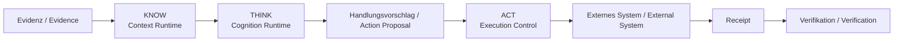

# UNITERA — Öffentliche Architektur und Dokumentation

> **Öffentliche Projektion — keine Autoritätsquelle.**
> **Public projection — not an authority source.**

Diese Dokumentation ist vollständig auf Deutsch und Englisch verfügbar. Beide Sprachfassungen bilden denselben fachlichen Stand ab; bei Abweichungen gilt die verifizierte Quelle im jeweils zuständigen Owner-Repository.

This documentation is available in complete German and English editions. Both editions represent the same reviewed state; if they diverge, the verified source in the owning repository prevails.

## Sprache / Language

- [Deutsch — Dokumentationsindex](docs/de/README.md)
- [English — documentation index](docs/en/README.md)

## UNITERA in Kürze / UNITERA at a glance

UNITERA ist ein anpassbares KI-Betriebssystem für unternehmensspezifische agentische Arbeit. Sein architektonischer Kern ist **kontrollierte Ausführung**: KI darf analysieren, entwerfen, planen und Handlungen vorschlagen. Verbindliche Geschäftswirkungen bleiben jedoch an Tenant-Kontext, Richtlinien, erforderliche menschliche Kontrolle, Grants, Ausführungsgrenzen, Receipts, Verifikation und Audit-Evidenz gebunden.

UNITERA is a customizable AI operating system for company-specific agentic work. Its architectural center is **governed execution**: AI may analyze, draft, plan, and propose actions, while binding business effects remain subject to tenant context, policy, required human control, grants, execution boundaries, receipts, verification, and audit evidence.

**Kernregel / Core rule:** Mehr Kontext, Rechenleistung oder Modellfähigkeit erzeugt niemals mehr Autorität. / More context, compute, or model capability never creates more authority.

## Aktueller Snapshot / Current snapshot

- Öffentlicher Stand / public state: `PUBLIC_STATE_2026-08-31`
- Discovery auf `Unitera_Systems/main`: ja, deterministisch, nicht aktiviert
- Owner Freeze: `FREEZE_NOT_AUTHORIZED`
- Production Execution: `NO`
- Details: [Deutsch — aktueller Stand](docs/de/status/current-state.md) · [English — current state](docs/en/status/current-state.md) · [Pilot readiness DE](docs/de/status/pilot-production-readiness.md) · [Pilot readiness EN](docs/en/status/pilot-production-readiness.md)

## Dokumentationsstatus / Documentation status

- Deutscher und englischer Dokumentationsbaum sind strukturell gespiegelt.
- German and English documentation trees are structurally mirrored.
- `PUBLICATION_MANIFEST.yaml` bleibt als sprachneutrales, maschinenlesbares Referenzmanifest einmalig an der Repository-Wurzel.
- `PUBLICATION_MANIFEST.yaml` remains a single language-neutral machine-readable reference manifest at the repository root.
- Mermaid diagrams follow the binding repository contract in [`MERMAID.md`](MERMAID.md) (GitHub-native renderer: [Creating Mermaid diagrams](https://docs.github.com/get-started/writing-on-github/working-with-advanced-formatting/creating-diagrams#creating-mermaid-diagrams)).
