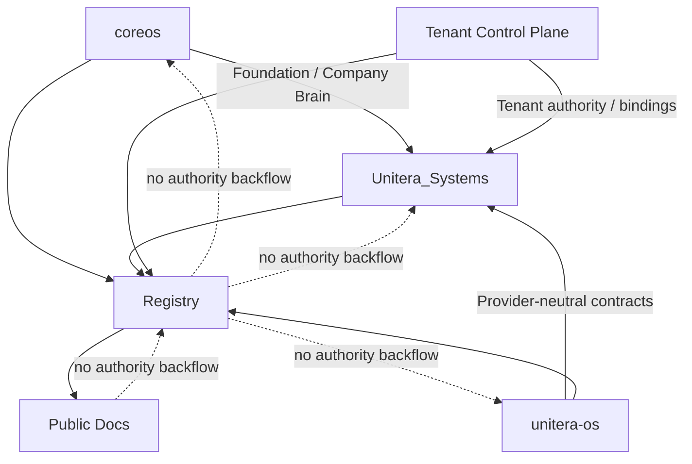

# Authority & Source-of-Truth Model

**Status:** PUBLIC PROJECTION

## Authority domains

| Domain | Owning surface | Public interpretation |
|---|---|---|
| Foundation, identity, Company Brain | `coreos` | Established authority domain |
| Agent autonomy, capability, policy, grant, execution contracts | `unitera-os` | Established provider-neutral authority domain |
| Runtime, persistence, API, integrations, product enforcement | `Unitera_Systems` | Established implementation/runtime boundary |
| Tenant control-plane authority | dedicated Tenant Control Plane authority surface | Owner-decided direction; adoption/materialization status must be checked before stronger claims |
| Cross-repo Registry | Registry surface | Reference/provenance layer only; never authority by itself |
| This repository | `unitera_public_docs` | Public documentation projection only |

## Principle

The Registry may record references, adoption state, digests, provenance, supersessions, dependency bindings, and qualified implementation bindings. It cannot create semantic, contract, tenant, execution, or runtime authority.

The public documentation layer adds **zero** authority. It exists to make the verified system state understandable.
