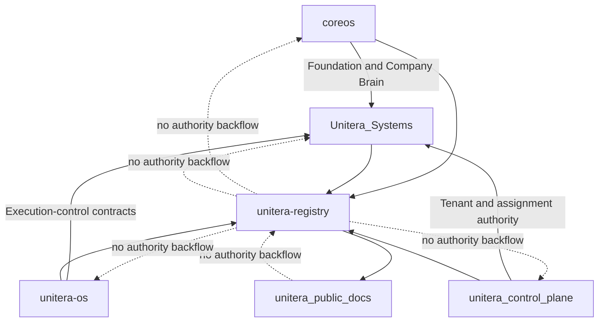

# Authority & Source-of-Truth Model

**Status:** PUBLIC PROJECTION  
**Authority:** none by itself  
**Source basis:** verified owner repositories plus the supplied 2026-08-15 source-state snapshot

## Authority domains

| Domain | Owning surface | Verified public interpretation |
|---|---|---|
| Foundation, institutional identity, Company Brain | `coreos` | Established authority domain; active Foundation baseline and deterministic Prime projection are owner-repository concerns |
| Capability, autonomy, policy, grant, receipt, execution-control contracts | `unitera-os` | Established provider-neutral authority domain |
| Tenant and Governance authority | `unitera_control_plane` | Physical owner is now materialized; assignment topology and bounded-pilot policy are canonical authority records |
| Runtime, persistence, API, integrations, sessions, product enforcement | `Unitera_Systems` | Established implementation boundary; implementation does not transfer semantic ownership |
| Cross-repository Registry | `unitera-registry` | Reference, provenance, adoption/implementation binding, and reachability only |
| Public documentation | `unitera_public_docs` | Explanation only |

## Precedence

When evidence conflicts, apply this reading order:

1. Verified canonical artifact in the owning repository.
2. Frozen phase or contract specification.
3. Owner-decision evidence pending formal adoption.
4. Architecture or replacement candidate.
5. Product/UX projection.
6. Legacy or conversational material.

This order is a documentation method, not a new authority layer.

## Source pointer posture

The supplied 2026-08-15 source snapshot reported `candidate_pointer_not_activated`. Later owner-repository materialization can supersede individual old assumptions, but this public repository does not infer that the unified source pointer itself has been activated. Pointer activation remains a separate, exact-evidence decision.

## Principle

The Registry may record references, status, digests, provenance, supersessions, consumers, and qualified implementation bindings. It cannot create semantic, tenant, execution, or runtime authority. Public documentation adds **zero** authority.
