# KNOW / THINK / ACT

**Status:** PUBLIC PROJECTION of the semantic core model

## KNOW — Context Runtime

Responsibilities include tenant binding, resource addressability, context compilation, freshness, provenance, epistemic state, privacy transforms, context budgets, lineage, and session bootstrap.

Resource handles are opaque, tenant-bound references. They are not credentials and carry no execution-grant semantics.

## THINK — Cognition Runtime

Responsibilities include analysis, planning, replanning, hypotheses, simulation, structured findings, action proposals, and learning candidates.

The compute envelope is bounded externally. **More compute never creates more authority.** Replanning may change the route, but it may not expand tenant, capability, objective, or autonomy bounds.

## ACT — Execution Control

```mermaid
flowchart LR
    AP[Action Proposal] --> CR[Capability Request]
    CR --> EA[Effective Autonomy Evaluation]
    EA --> PE[Policy Evaluation]
    PE --> HC[Human Control if required]
    HC --> G[Capability Grant]
    G --> RE[Pre-dispatch Re-evaluation]
    RE --> TE[Trusted Executor]
    TE --> AD[Execution Adapter]
    AD --> ES[External System]
    ES --> RC[Receipt]
    RC --> V[Verification]
    V --> CL[Closure / Reconciliation / Containment]
```

An action proposal is not an effect. A capability request is not a grant. A receipt is not verification.
