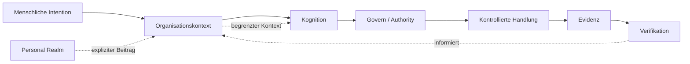

# UNITERA Public Docs

`UPD-START-001` · `ORIENTATION` · `PUBLIC_CORE`

> **The Architecture of Trusted Autonomy**  
> UNITERA verbindet Organisationskontext, begrenzte Kognition, menschliche und institutionelle Authority, kontrollierte Wirkung und dauerhafte Evidenz, ohne Modellfähigkeit mit Authority gleichzusetzen.



## Zuerst das System lesen

Das Diagramm ist eine **konzeptionelle öffentliche Projektion**, keine Deployment-, Repository-, Protokoll- oder Sicherheitstopologie. Nutze die [Systemkarte](architecture/system-map.md), wenn du Grenzen und Beziehungen statt eines Seitenbaums verstehen willst.

## Lesen nach Intention

<table data-view="cards"><thead><tr><th></th><th></th><th></th><th data-hidden data-card-target data-type="content-ref"></th></tr></thead><tbody>
<tr><td><strong>UNITERA verstehen</strong></td><td>Das mentale Modell in wenigen Minuten aufbauen.</td><td>KNOW → THINK → Govern → ACT → PROVE</td><td><a href="getting-started/unitera-in-5-minutes.md">UNITERA in 5 Minuten</a></td></tr>
<tr><td><strong>Architektur verfolgen</strong></td><td>Systemschichten, Vertrauensgrenzen und Runtime-Beziehungen verfolgen.</td><td>Cartography</td><td><a href="architecture/system-map.md">Systemkarte</a></td></tr>
<tr><td><strong>Einen realen Flow verfolgen</strong></td><td>Sehen, wie Kontext, Vorschläge, Entscheidungen und Wirkung zusammenhängen.</td><td>Flow</td><td><a href="getting-started/customer-request-from-a-to-z.md">Kundenanliegen A–Z</a></td></tr>
<tr><td><strong>Governance prüfen</strong></td><td>Öffentliche Authority-, Disclosure- und Assurance-Semantik nachvollziehen.</td><td>Governed instrument</td><td><a href="reference/governance.md">Governance</a></td></tr>
<tr><td><strong>Build / Integrate</strong></td><td>An der öffentlichen Integrationsgrenze starten, ohne unveröffentlichte APIs anzunehmen.</td><td>Developer entry</td><td><a href="build/README.md">Build / Integrate</a></td></tr>
</tbody></table>

## Aktuelle Haltung

Die öffentliche Dokumentation beschreibt derzeit etablierte Kernarchitektur, begrenzte Umsetzungen und einen aktiven Weg in Richtung Pilot-Reife. Sie **behauptet keine Produktionsautonomie**. Den gepflegten Reifegrad zeigt der [aktuelle öffentliche Stand](status/current-state.md).

## Drei Lesemodi

| Modus | Nutze ihn, wenn du… | Primäre Flächen |
|---|---|---|
| **Systems Cartography** | verstehen willst, wo etwas liegt und was es berührt | Systemkarte, Architektur, Grenzen, Flows |
| **Knowledge Publication** | verstehen willst, warum etwas existiert und wie es funktioniert | Konzepte, Spezifikation, Build/Referenz |
| **Governed System Instrument** | Authority, Gates, Status, Evidenz und Konsequenzen prüfen willst | Governance, Reife, Assurance |

Die Sidebar ist ein Index. Die Systembeziehungen bilden das eigentliche mentale Modell.
