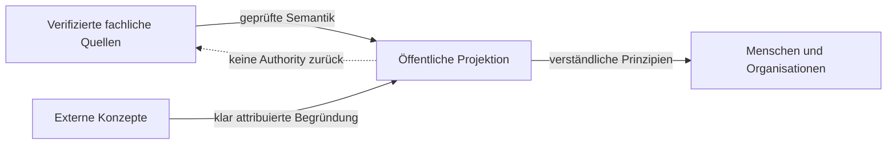
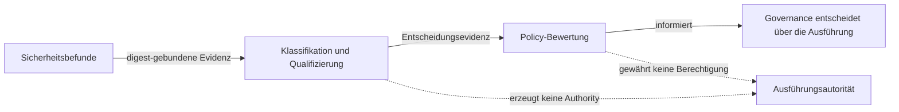

# Authority- und Quellenmodell

Status: `PUBLIC_ABSTRACTED`

Verifizierte Owner-Quellen definieren fachliche Wahrheit. Die öffentliche Dokumentation erklärt diese Wahrheit in reduzierter Form und erzeugt selbst keine Authority.

Kandidaten bleiben Kandidaten. Publikation ist keine Adoption; Adoption ist keine Runtime-Aktivierung. Exakte Quellenstände werden intern verifiziert, aber nicht als operative Landkarte publiziert.

## Sicherheitsbewertung ohne Ausführungsautorität

UNITERA trennt Sicherheitsklassifikation, Evidenz-Qualifizierung und Policy-Bewertung von der Ausführungsautorität.

Sicherheitsbefunde können mit qualifizierter historischer Evidenz verglichen und deterministisch bewertet werden, ohne dass ein bereits bestehender Befund als akzeptiertes Risiko behandelt wird. Mehrdeutige oder nicht verifizierbare Evidenz schlägt kontrolliert fehl (fail-closed) und wird explizit abgeglichen, statt auf falsche Sicherheit gerundet zu werden.

Sicherheits-Evidenz allein gewährt keine Runtime-, Mandanten- oder Geschäftsberechtigung: Eine freigegebene Bewertung ist kein Capability-Grant, und eine quittierte Annahme ist keine Verifizierung des Geschäftsergebnisses.

Diese Bewertungsfähigkeit ist intern als Klassifikations- und Qualifizierungsschicht etabliert. Breitere Runtime- oder Produktions-Durchsetzung besteht erst nach separater Owner-Autorität und Aktivierung; sie wird von dieser Dokumentation nicht beansprucht.

> Conceptual public projection — not deployment, service, repository, protocol or security topology.

---

[← Vorherige: Verantwortungs- und Vertrauensdomänen](repository-topology.md) · [Index](../README.md) · [Nächste: KNOW / THINK / ACT →](know-think-act.md)
