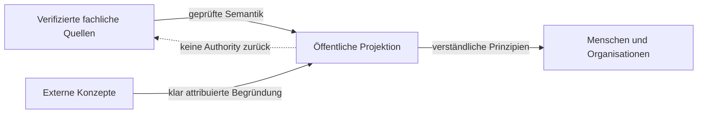

# Authority- und Quellenmodell

Status: `PUBLIC_ABSTRACTED`

Verifizierte Owner-Quellen definieren fachliche Wahrheit. Die öffentliche Dokumentation erklärt diese Wahrheit in reduzierter Form und erzeugt selbst keine Authority.

Kandidaten bleiben Kandidaten. Publikation ist keine Adoption; Adoption ist keine Runtime-Aktivierung. Exakte Quellenstände werden intern verifiziert, aber nicht als operative Landkarte publiziert.

> Conceptual public projection — not deployment, service, repository, protocol or security topology.

---

[← Vorherige: Verantwortungs- und Vertrauensdomänen](repository-topology.md) · [Index](../README.md) · [Nächste: KNOW / THINK / ACT →](know-think-act.md)
