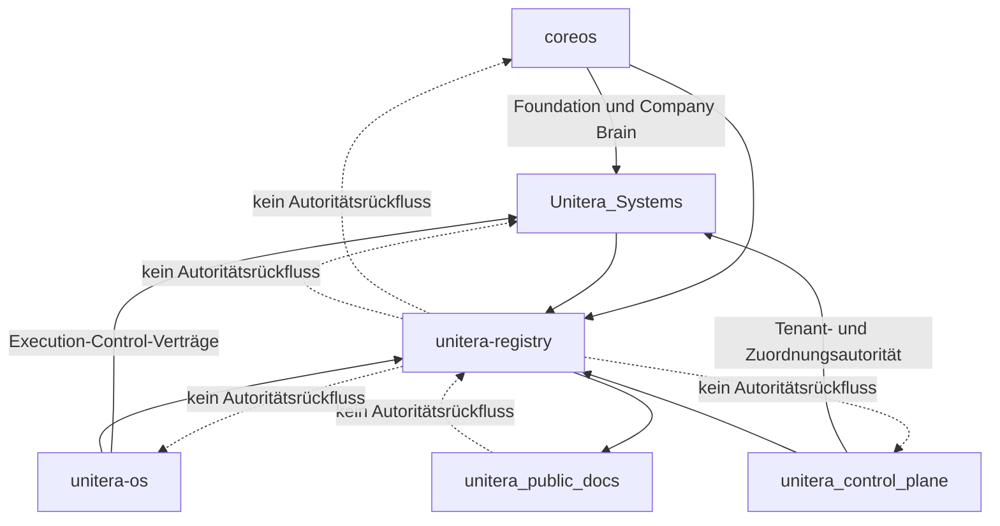

# Autoritäts- und Source-of-Truth-Modell

**Status:** PUBLIC PROJECTION  
**Autorität:** keine aus sich selbst heraus  
**Quellengrundlage:** verifizierte Owner-Repositories sowie der bereitgestellte Source-State-Snapshot vom 15.08.2026

## Autoritätsdomänen

| Domäne | Zuständige Oberfläche | Verifizierte öffentliche Einordnung |
|---|---|---|
| Foundation, institutionelle Identität, Company Brain | `coreos` | Etablierte Autoritätsdomäne; aktive Foundation-Baseline und deterministische Prime-Projektion sind Angelegenheiten des Owner-Repositories |
| Capability, Autonomie, Policy, Grant, Receipt und Execution-Control-Verträge | `unitera-os` | Etablierte providerneutrale Autoritätsdomäne |
| Tenant- und Governance-Autorität | `unitera_control_plane` | Physischer Owner ist materialisiert; Zuordnungstopologie und begrenzte Pilot-Policy sind kanonische Autoritätsnachweise |
| Runtime, Persistenz, API, Integrationen, Sessions und Produkterzwingung | `Unitera_Systems` | Etablierte Implementierungsgrenze; Implementierung überträgt keine semantische Zuständigkeit |
| Repository-übergreifende Registry | `unitera-registry` | Nur Referenz, Provenienz, Adoptions-/Implementierungsbindung und Erreichbarkeit |
| Öffentliche Dokumentation | `unitera_public_docs` | Nur Erklärung |

## Vorrangfolge

Bei widersprüchlicher Evidenz gilt folgende Lesereihenfolge:

1. Verifiziertes kanonisches Artefakt im zuständigen Owner-Repository.
2. Eingefrorene Phasen- oder Vertragsspezifikation.
3. Evidenz einer Owner-Entscheidung vor formaler Adoption.
4. Architektur- oder Ersatzkandidat.
5. Produkt-/UX-Projektion.
6. Veraltetes oder rein konversationelles Material.

Diese Reihenfolge ist eine Dokumentationsmethode, keine neue Autoritätsschicht.

## Status des Source Pointers

Der Source-Snapshot vom 15.08.2026 meldete `candidate_pointer_not_activated`. Spätere Materialisierungen in Owner-Repositories können einzelne ältere Annahmen ablösen. Dieses öffentliche Repository leitet daraus jedoch keine Aktivierung des einheitlichen Source Pointers ab. Eine Pointer-Aktivierung bleibt eine eigenständige Entscheidung mit exakter Evidenz.

## Prinzip

Die Registry darf Referenzen, Status, Digests, Provenienz, Supersessions, Consumer und qualifizierte Implementierungsbindungen erfassen. Sie kann keine semantische, Tenant-, Ausführungs- oder Runtime-Autorität erzeugen. Die öffentliche Dokumentation fügt **null** Autorität hinzu.

