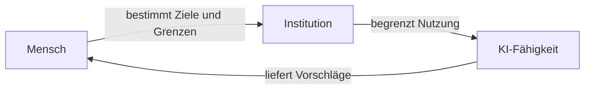
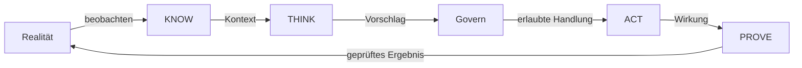
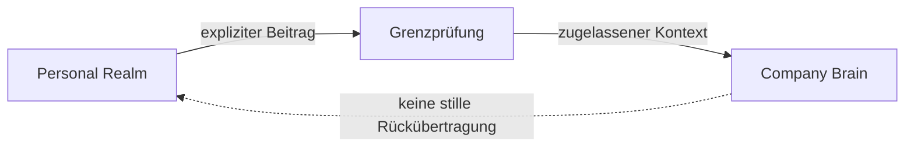
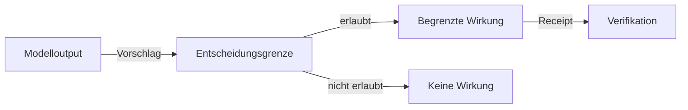
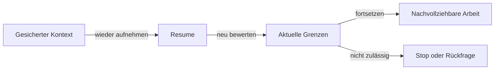

# Human Agency und Model Sovereignty

**Disclosure:** PUBLIC_CORE · PUBLIC_ABSTRACTED
**Adoption:** etablierte Semantik plus nicht adoptierte Synthese-Kandidaten
**Autorität:** keine aus sich selbst heraus

UNITERA behandelt KI als verstärkende Fähigkeit unter menschlicher und
institutioneller Entscheidungshoheit. Modelle können wechseln; die Grenzen
einer Handlung dürfen sich dadurch nicht verändern.

## Semantische Einordnung

| Klasse | Öffentliche Einordnung |
|---|---|
| Bereits etablierte Semantik | Context ist keine Permission; Modellfähigkeit ist keine Authority; Receipt ist keine Verification; persönliche und institutionelle Kontinuität bleiben getrennt. |
| Extern gestützte Begründung | Konzeptionelles Material stützt den Fokus auf menschliche Handlungsfähigkeit, langlebige Institutionen und austauschbare Modelle. Es ist Begründung, keine UNITERA-Autorität. |
| Neue Adoptionskandidaten | Die gemeinsame Rahmung als Human Agency und Model Sovereignty sowie ihre zusammenhängende öffentliche Erzählung. |
| Offene Lücken | Formale Adoption der Gesamtrahmung sowie vollständige Portabilitäts-, Recovery- und Ende-zu-Ende-Qualifikation. |

Die externe Begründung wurde aus einem bereitgestellten automatischen Transkript
der öffentlichen Podcast-Episode
[„KI-Star Armin Ronacher: KI ist geil – aber die Blase wird platzen“](https://podcasts.apple.com/at/podcast/ki-star-armin-ronacher-ki-ist-geil-aber-die-blase-wird/id1896588425?i=1000787286885)
abgeleitet. Die Episodenmetadaten wurden aufgelöst; übernommene Transkriptanker
wurden nicht unabhängig erneut geprüft.

## Human Agency

Menschen bestimmen Ziele, Grenzen und verbindliche Entscheidungen.
Institutionen definieren die für ihren Verantwortungsraum geltenden Regeln.
KI unterstützt innerhalb dieser Grenzen.

> **Conceptual public projection — not deployment, service, repository, protocol or security topology.**

## Der Kernloop

KNOW stellt zweckgebundenen Kontext bereit. THINK analysiert und schlägt vor.
Govern prüft, ob Wirkung zulässig ist. ACT führt nur erlaubte Wirkung aus.
PROVE trennt Ausführungsevidenz von Ergebnisprüfung.

> **Conceptual public projection — not deployment, service, repository, protocol or security topology.**

## Persönliche und institutionelle Grenze

Der Personal Realm bewahrt persönliche Kontinuität. Das Company Brain trägt
kontrollierten institutionellen Kontext. Ein Übergang zwischen beiden ist eine
bewusste, zweckgebundene Handlung und keine automatische Übernahme.

> **Conceptual public projection — not deployment, service, repository, protocol or security topology.**

## Governed Effect

Ein Modelloutput ist ein Vorschlag. Verbindliche Wirkung entsteht erst nach
einer getrennten Autoritätsprüfung und bleibt durch Evidenz und Verifikation
überprüfbar.

> **Conceptual public projection — not deployment, service, repository, protocol or security topology.**

## Resume Continuity

Fortsetzung bedeutet, nachvollziehbaren Arbeitskontext wieder aufzunehmen. Sie
reaktiviert weder frühere Erlaubnisse noch erzeugt sie neue Autorität.

> **Conceptual public projection — not deployment, service, repository, protocol or security topology.**

## Aussagegrenze

Diese Seite macht Architekturprinzipien und neue Adoptionskandidaten sichtbar.
Sie adoptiert keine Invarianten, aktiviert keine Governance, vergibt keine
Capabilities und bewirkt keine Runtime- oder Produktionsänderung.

---

[← Vorherige: Architektur und Logik](architecture-and-logic-deep-dive.md) · [Index](../README.md) · [Nächste: Verantwortungs- und Vertrauensdomänen →](repository-topology.md)
