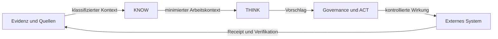

# KNOW / THINK / ACT

Status: `PUBLIC_CORE`

- **KNOW** stellt zweckgebundenen, aktuellen und nachvollziehbaren Kontext bereit.
- **THINK** analysiert, plant und erstellt Vorschläge innerhalb gesetzter Grenzen.
- **ACT** bewertet Authority und Richtlinien, kontrolliert reale Wirkung und erzeugt Evidenz.

Mehr Kontext oder Modellleistung erzeugt niemals mehr Authority.

> Conceptual public projection — not deployment, service, repository, protocol or security topology.

---

[← Vorherige: Authority- und Quellenmodell](authority-and-source-model.md) · [Index](../README.md) · [Nächste: Lokale und persönliche Vertrauensgrenze →](local-node-personal-realm-trust-boundary.md)
