# KNOW / THINK / ACT

**Status:** PUBLIC PROJECTION des semantischen Kernmodells

## KNOW — Context Runtime

Zu den Aufgaben gehören Tenant-Bindung, Adressierbarkeit von Ressourcen, Kontextkompilierung, Aktualität, Provenienz, epistemischer Zustand, Datenschutztransformationen, Kontextbudgets, Lineage und Session-Bootstrap.

Resource Handles sind opake, Tenant-gebundene Referenzen. Sie sind keine Zugangsdaten und enthalten keine Semantik eines Execution Grants.

## THINK — Cognition Runtime

Zu den Aufgaben gehören Analyse, Planung, Neuplanung, Hypothesen, Simulation, strukturierte Findings, Action Proposals und Lernkandidaten.

Der Compute Envelope wird von außen begrenzt. **Mehr Rechenleistung erzeugt niemals mehr Autorität.** Neuplanung darf den Weg verändern, aber Tenant-, Capability-, Ziel- oder Autonomiegrenzen nicht erweitern.

## ACT — Execution Control

```mermaid
flowchart LR
    AP[Action Proposal] --> CR[Capability Request]
    CR --> EA[Bewertung effektiver Autonomie]
    EA --> PE[Policy-Bewertung]
    PE --> HC[Menschliche Kontrolle, falls erforderlich]
    HC --> G[Capability Grant]
    G --> RE[Erneute Prüfung vor Dispatch]
    RE --> TE[Trusted Executor]
    TE --> AD[Execution Adapter]
    AD --> ES[Externes System]
    ES --> RC[Receipt]
    RC --> V[Verifikation]
    V --> CL["Abschluss / Abgleich / Eindämmung"]
```

Ein Action Proposal ist keine Wirkung. Ein Capability Request ist kein Grant. Ein Receipt ist keine Verifikation.
