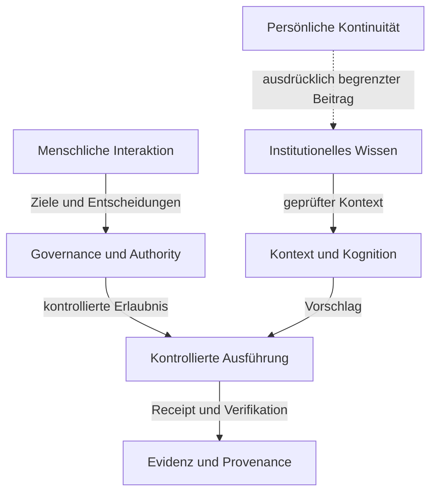

# Verantwortungs- und Vertrauensdomänen

Status: `PUBLIC_ABSTRACTED`

Die öffentliche Architektur zeigt Verantwortungsrollen, keine Repository-, Service- oder Deployment-Topologie.

Die physische Zuordnung, interne Verträge und Enforcement-Ketten bleiben in den zuständigen internen Quellen.

> Conceptual public projection — not deployment, service, repository, protocol or security topology.

---

[← Vorherige: Human Agency und Model Sovereignty](human-agency-and-model-sovereignty.md) · [Index](../README.md) · [Nächste: Authority- und Quellenmodell →](authority-and-source-model.md)
