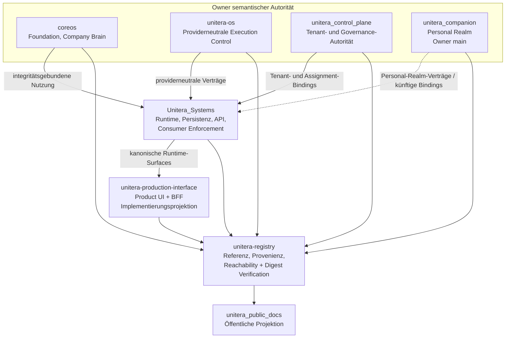
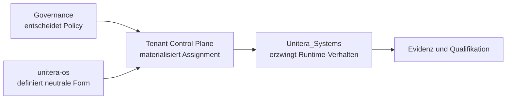

# Repository- und Autoritätstopologie

**Status:** PUBLIC PROJECTION  
**Autorität:** keine aus sich selbst heraus  
**Quellengrundlage:** verifizierte Default-Branch-Refs plus ausdrücklich markierte qualifizierte Implementierungs-/Review-Refs in `PUBLICATION_MANIFEST.yaml`

UNITERA trennt bewusst semantische Autorität, Runtime-Implementierung, Produktprojektion, Provenienz und öffentliche Kommunikation.



## Zuständigkeitsmatrix

| Repository | Zuständigkeit / Materialisierung | Wird durch Implementierung oder Indexierung nicht übertragen |
|---|---|---|
| `coreos` | Foundation, Company Brain und institutionelle Kontextsemantik | Tenant-Control- oder Wirkungsautorität |
| `unitera-os` | Providerneutrale Capability-, Autonomie-, Policy-, Grant-, Receipt- und Execution-Control-Verträge | Tenant-Assignment-Autorität oder Eigentum an der Produkt-Runtime |
| `unitera_control_plane` | Tenant-Identität, Lifecycle, Ownership und Membership sowie Governance-Policy und Tenant-Agent-Assignment | Providerneutrale Wirkungsverträge oder nachgelagerte Runtime-Qualifikation |
| `unitera_companion` | Personal-Realm-Semantik: Realm-Lifecycle/-Binding-Beziehung, Companion, Personal Memory, Circling, persönliche Ideation/Planung, Personal Autonomy und Recovery-Semantik. Das Architekturfundament ist jetzt auf Owner-`main@8dd8112` gemerged. | Person-/PlatformPrincipal-Identity, Membership-/Tenant-Authority, Company Brain oder providerneutrale Execution-Authority |
| `Unitera_Systems` | Runtime-Erzwingung, Persistenz, APIs, Sessions, kanonische Product-/Runtime-Consumer-Surfaces, Integrationen und Evidenzpersistenz | Semantisches Eigentum allein aufgrund der Implementierung eines Vertrags |
| `unitera-production-interface` | Production Pilot Interface als Product UI + BFF; produktlokale Profile/Preferences und authority-sichere Projektionen | Tenant, Membership, Company Brain, Capability, Grant, Dispatch, Receipt, Verification oder Execution Authority |
| `unitera-registry` | Repository-übergreifende Referenzen, Provenienz, Adoptions-/Implementierungsbindungen, Reachability und Digest-Verification-Evidenz | Autorität, Aktivierung, Tenant-Ownership, Source Adoption oder Ausführungserlaubnis |
| `unitera_public_docs` | Öffentliche Erklärung und Diagramme | Jegliche semantische, vertragliche, Runtime-, Tenant- oder Ausführungsautorität |

## Trennung der Tenant-Agent-Zuordnung



Der Owner-Vertrag kann kanonisch sein, während eine nachgelagerte Conformance-Deklaration separat offen bleibt. **Runtime-Materialisierung != semantische Autorität.**

Der aktuelle Registry-Freeze-Readiness-Report bewahrt diese Trennung ausdrücklich: Eine durchgeführte Runtime-Qualifikation erlaubt der Registry nicht, einen Owner-Vertrag zu überschreiben, der weiterhin einen anderen Enforcement-Stand ausweist.

## Trennung der Product-Implementierung

Das aktuelle Projekt besitzt nun zwei unterschiedliche Implementierungs-Surfaces, die nicht zusammenfallen dürfen:

```text
Unitera_Systems
= kanonische Runtime-/API-/Persistenz-/Consumer-Enforcement-Surface

unitera-production-interface
= dediziertes Production Pilot Interface
= Browser Product UI + kleines serverseitiges BFF
```

Das Production Interface konsumiert/adaptiert kanonische Surfaces. Sein lokales Schema und sein Product State sind Implementierungs-/Projektionsbelange.

```text
Product UI existiert
!= kanonische Authority existiert lokal

Button enabled
!= Grant

Produktprojektion
!= Company-Brain-Wahrheit
```

Der gemergte Settings-/Profile-Slice lässt Membership-Rollenänderungen, Invitation Authority, Tenant-Mutation und Company-Brain-Mutation bewusst nicht verfügbar oder nur als Projektion zu. Production Execution und Live Effects bleiben aus.

## Qualifizierte Integrations-Branches

Zwei wichtige `Unitera_Systems`-Branches sind in der öffentlichen Source Basis sichtbar, ohne zu kanonischem main hochgestuft zu werden:

- Discovery PR #94 bei `19e70f2`: 15 vor / 0 hinter `main`, qualifizierter Development Slice.
- Pilot UI / Identity / Dual Control PR #98 bei `903f025`: offen, qualifizierte Integration in Review; alle fünf beobachteten Remote-Workflow-Familien sind auf genau diesem Head erfolgreich.

Diese Branches können Implementierungsfortschritt belegen. Sie erzeugen durch Tests allein weder Owner Authority noch Source Adoption, Runtime Activation oder Production Permission.

## Beziehung zur Registry

Registry-Validierung, Reachability und Digest Verification können belegen, dass aufgezeichnete Referenzen und Bytes mit Git-Evidenz übereinstimmen. Sie können kein Produktionsverhalten beweisen, keine Quelle aktivieren, keinen Pilot autorisieren und keine Permission verleihen.

Das aktuelle Registry-main `891f9b9` stärkt diese Integritätsrolle durch den Abschluss des RCC-/Digest-Verification-Programms, ohne Owner Authority oder Source Pointer zu verändern.

## Status der Personal-Realm-Owner-Surface

Die frühere Beschreibung „PR offen“ ist superseded.

Personal-Realm-PR #1 ist gemerged; `unitera_companion/main@8dd8112` ist das aktuelle Owner-main-Architekturfundament.

Weiterhin getrennt:

```text
Owner Foundation gemerged
!= Cross-Repo Adoption abgeschlossen
!= Runtime aktiviert
!= Production Execution autorisiert
```
