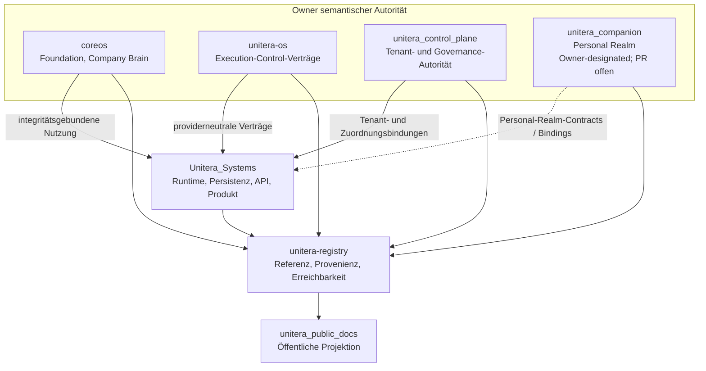
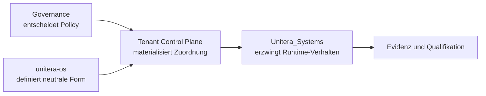

# Repository- und Autoritätstopologie

**Status:** PUBLIC PROJECTION  
**Autorität:** keine aus sich selbst heraus  
**Quellengrundlage:** verifizierte `main`-Refs der Owner-Repositories plus ausdrücklich markierte qualifizierte Owner-Materialisierung in `PUBLICATION_MANIFEST.yaml`

UNITERA trennt bewusst semantische Autorität, Runtime-Implementierung, Provenienz und öffentliche Kommunikation.

## Zuständigkeitsmatrix

| Repository | Zuständigkeit | Wird durch Implementierung oder Indexierung nicht übertragen |
|---|---|---|
| `coreos` | Foundation, Company Brain und institutionelle Kontextautorität | Tenant-Control- oder Wirkungsautorität |
| `unitera-os` | Providerneutrale Capability-, Autonomie-, Policy-, Grant-, Receipt- und Execution-Control-Verträge | Tenant-Zuordnungsautorität oder Eigentum an der Produkt-Runtime |
| `unitera_control_plane` | Tenant-Identität, Lifecycle, Ownership und Membership sowie Governance-Policy und Tenant-Agent-Zuordnung | Providerneutrale Wirkungsverträge oder nachgelagerte Runtime-Qualifikation |
| `unitera_companion` | Owner-designierte Personal-Realm-Semantik: Realm-Lifecycle/-Binding-Beziehung, Companion, Personal Memory, Circling, persönliche Ideation/Planung, Personal Autonomy und Recovery-Semantik. Die aktuelle Architekturmaterialisierung liegt auf dem qualifizierten PR #1 und noch nicht auf Owner-`main`. | Person-/PlatformPrincipal-Identity, Membership-/Tenant-Authority, Company Brain oder providerneutrale Execution-Authority |
| `Unitera_Systems` | Runtime-Erzwingung, Persistenz, API, Sessions, Produktoberflächen, Integrationen und Evidenzpersistenz | Semantisches Eigentum allein aufgrund der Implementierung eines Vertrags |
| `unitera-registry` | Repository-übergreifende Referenzen, Provenienz, Adoptions- und Implementierungsbindungen sowie Erreichbarkeitsprüfungen | Autorität, Aktivierung, Tenant-Ownership oder Ausführungserlaubnis |
| `unitera_public_docs` | Öffentliche Erklärung und Diagramme | Jegliche semantische, vertragliche, Runtime-, Tenant- oder Ausführungsautorität |

## Trennung der Tenant-Agent-Zuordnung

Der Owner-Vertrag kann kanonisch sein, während die nachgelagerte Runtime-Erzwingung separat unqualifiziert bleibt. **Runtime-Materialisierung ≠ semantische Autorität.**

## Beziehung zur Registry

Registry-Validierung und Erreichbarkeitsprüfungen können belegen, dass Referenzen auflösbar und konform sind. Sie können kein Produktionsverhalten beweisen, keine Quelle aktivieren und keine Erlaubnis verleihen.

## Status der Personal-Realm-Owner-Surface

Die Owner-Entscheidung für das Personal Realm ist finalisiert. Das aktuelle Architekturfundament liegt jedoch noch auf `unitera_companion/architecture/personal-realm-foundation@cb59971c` in PR #1. Diese öffentliche Topologie behandelt das Repository deshalb als **owner-designierte semantische Surface**, trennt die Branch-Materialisierung aber ausdrücklich von einem gemergten kanonischen Default-Branch-Stand.
