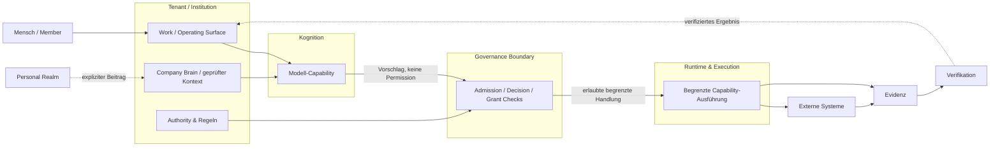

# Systemkarte

`UPD-MAP-001` · `ORIENTATION / CARTOGRAPHY` · `PUBLIC_ABSTRACTED` · `ADOPTED`

> **Warum existiert das?**  
> UNITERA lässt sich als Zusammenspiel von Verantwortungs- und Vertrauensdomänen besser verstehen als als Liste von Services oder Repositories.



| Kontext | Öffentliche Projektion |
|---|---|
| **You are here** | Start → Systemkarte |
| **System Layer** | Mensch → Tenant/Kontext → Kognition → Governance → Runtime/Execution → Evidenz |
| **Authority** | Capability oder Kognition erzeugen keine Authority; Authority wird getrennt geprüft |
| **Boundary** | lokale/persönliche, institutionelle, Kognitions-, Governance- und External-Effect-Grenzen |
| **Reife** | Architektur etabliert; Umsetzungsreife variiert je Bereich |

## Öffentliche Topologie

> Konzeptionelle öffentliche Projektion — keine Deployment-, Service-, Repository-, Protokoll- oder Sicherheitstopologie.

## Grenzen lesen

| Boundary | Was sie überquert | Was **nicht** automatisch überquert |
|---|---|---|
| Persönlich → institutionell | expliziter, zweckgebundener Beitrag | persönliche Kontinuität, Berechtigungen, verborgenes Memory |
| Kontext → Kognition | hinreichend relevanter freigegebener Kontext | institutionelle Wahrheit oder Authority |
| Kognition → Governance | Analyse / Vorschlag | Ausführungserlaubnis |
| Governance → Runtime | aktuell gültiger, begrenzter Autorisierungspfad | unbeschränkte Autonomie |
| Runtime → externes System | erlaubte Wirkung | breitere Capability als die genehmigte Handlung |
| Execution → Evidenz → Verifikation | Receipt/Evidenz und spätere Ergebnisprüfung | Receipt ≠ verifizierter Erfolg |

## Drill-down

- [Human Agency und Model Sovereignty](human-agency-and-model-sovereignty.md)
- [Authority- und Source-of-Truth-Modell](authority-and-source-model.md)
- [Local Runtime Node × Personal Realm](local-node-personal-realm-trust-boundary.md)
- [Cognition Runtime](../runtime/cognition-runtime.md)
- [Kontrollierte externe Wirkung](../runtime/governed-effect.md)
- [Aktueller öffentlicher Stand](../status/current-state.md)
