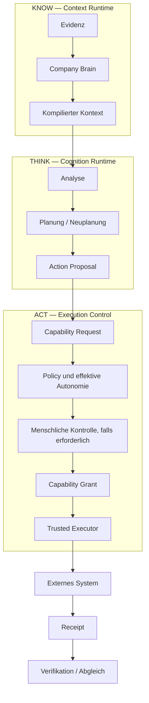

# Systemübersicht

**Status:** PUBLIC PROJECTION  
**Autorität:** keine aus sich selbst heraus

UNITERA trennt Organisationswissen, Kognition und externe Handlung, damit leistungsfähigeres KI-Reasoning nicht unbemerkt geschäftliche Autorität erweitert.

## Systemthese

UNITERA lässt sich als **evidenzbasierte, kontextkompilierte und autoritätsgetrennte Ausführung** zusammenfassen.

Die Architektur behandelt weder Modell, Prompt, Harness, externes Werkzeug noch Adapter als Autoritätsgrenze. Autorität bleibt in den zuständigen Domänen und in der Runtime-Erzwingung explizit.

