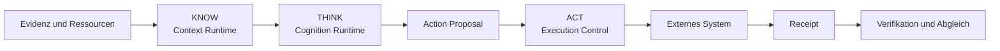
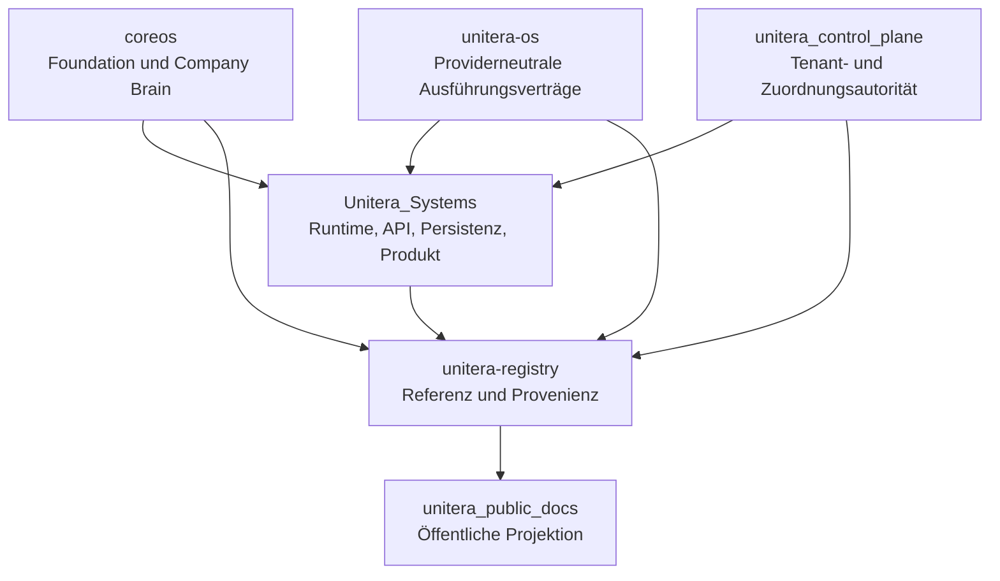

# UNITERA — Öffentliche Architektur und Dokumentation

> **Öffentliche Projektion — keine Autoritätsquelle.**
>
> Dieses Repository erläutert die verifizierte UNITERA-Architektur und ihren Implementierungsreifegrad. Es erzeugt oder ersetzt weder Owner-Verträge, Tenant-Autorität, Runtime-Autorität, Registry-Status, Grants noch Produktionsaktivierung.

UNITERA ist ein anpassbares KI-Betriebssystem für unternehmensspezifische agentische Arbeit. Sein architektonischer Kern ist **kontrollierte Ausführung**: KI darf analysieren, entwerfen, planen und Handlungen vorschlagen. Verbindliche Geschäftswirkungen bleiben an expliziten Tenant-Kontext, Richtlinien, erforderliche menschliche Kontrolle, Grants, Ausführungsgrenzen, Receipts, Verifikation und Audit-Evidenz gebunden.

## System auf einen Blick

**Kernregel:** Mehr Kontext, Rechenleistung oder Modellfähigkeit erzeugt niemals mehr Autorität.

## Autoritäts- und Implementierungstopologie

Die Registry referenziert Autorität; sie erzeugt keine Autorität. Dieses Repository liegt noch einen Schritt weiter nachgelagert: Es ist eine menschenlesbare Projektion verifizierten Owner-Materials.

## Aktueller Reifegrad — 29.08.2026

| Oberfläche | Öffentlicher Status |
|---|---|
| Company-Brain-Autorität und deterministische Foundation-Projektion | **MATERIALIZED**, Owner: `coreos` |
| Execution-Control-Verträge und begrenzter `email.send.commit`-Pfad | **MATERIALIZED / ESTABLISHED**, Owner: `unitera-os`; Runtime-Consumer: `Unitera_Systems` |
| Gehostetes OIDC-Sign-in, opake Sessions und interne Identity-/Tenant-/Membership-Bindung | **MATERIALIZED** auf `Unitera_Systems/main` |
| Self-Service-Sign-up, Profilabschluss und Tenant-Bootstrap | **OPEN**; derzeit kein produktionsreifer kanonischer Ablauf belegt |
| Discovery Runtime und `/work/discovery` | **QUALIFIED DEVELOPMENT SLICE**, nicht in kanonisches `main` gemergt |
| Cognition Compute-Envelope-Vertrag | **MATERIALIZED**; vollständige Cognition-Runtime-Autorität und ihr Lifecycle bleiben **OPEN** |
| Semantik der Tenant-Agent-Zuordnung | **MATERIALIZED AS AUTHORITY CONTRACT**; nachgelagerte Runtime-Qualifikation bleibt separat |
| Registry-Validierung und Repository-übergreifende Erreichbarkeit | Auf Registry `main` **ENFORCED**; Registry bleibt reine Referenz |
| Local Runtime Node | **CANDIDATE** |

Exakte Refs und Nichtaussagen stehen in der [Current-State-Matrix](status/current-state.md).

## Publikationslabels

| Label | Bedeutung |
|---|---|
| **ESTABLISHED** | Stabile Architektur oder Autoritätsgrenze, die durch eine zuständige Quelle getragen wird. |
| **MATERIALIZED** | Im zuständigen Owner-Repository oder auf der Runtime-Oberfläche implementiert. |
| **QUALIFIED DEVELOPMENT SLICE** | Außerhalb von kanonischem `main` implementiert und belegt; noch nicht kanonisch oder produktiv aktiv. |
| **CANDIDATE** | Quellenwürdige Richtung, aber keine kanonische Autorität. |
| **OPEN** | Ungelöst, nicht adoptiert oder nicht ausreichend verifiziert. |
| **PUBLIC PROJECTION** | Ausschließlich erklärende Darstellung. |

## Nicht verhandelbare Grenzen

- Evidence ≠ Truth
- Message ≠ Claim
- Claim ≠ Active Institutional Truth
- Discovery ≠ Activation
- Context ≠ Permission
- Approval ≠ Capability Grant
- Receipt ≠ Verification
- Runtime implementation ≠ Semantic Authority
- Model capability ≠ Authority

## Aussageposition

UNITERA besitzt derzeit einen substanziellen kontrollierten Kern und mehrere qualifizierte Implementation Slices. Dieses Repository behauptet weder automatische regulatorische Compliance, Zertifizierung, unbeschränkte Autonomie, vollständige End-to-End-Production-Readiness noch eine abgeschlossene Self-Service-Onboarding-Journey.

Widerspricht dieses Repository einem verifizierten zuständigen Artefakt, **gewinnt das Owner-Artefakt**.
