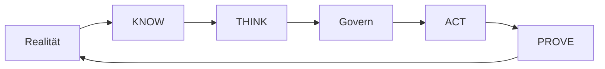

# UNITERA — Überblick

**Disclosure:** PUBLIC_CORE · PUBLIC_ABSTRACTED · PUBLIC_STATUS

**Autorität:** keine aus sich selbst heraus

UNITERA ist ein anpassbares KI-Betriebssystem für organisationsspezifische
agentische Arbeit. Es verbindet ein kontrolliertes **Company Brain** mit
KNOW/THINK/ACT, einem **Personal Realm** und nachvollziehbarer Wirkung.

## Kernprinzipien

- **Human Agency:** Menschen und Institutionen behalten Entscheidungshoheit.
- **Model Sovereignty:** Modelle sind austauschbare Kognitionsmittel, keine
  Autoritätsquellen.
- **Authority Separation:** Wissen, Vorschlag, Freigabe, Wirkung und Prüfung
  bleiben unterscheidbar.
- **Governed Effect:** Eine vorgeschlagene Handlung ist noch keine erlaubte
  Wirkung.
- **Resume Continuity:** Arbeit kann mit nachvollziehbarem Kontext fortgesetzt
  werden, ohne stillschweigende Rechte zu übernehmen.

*Conceptual public projection — not deployment, service, repository, protocol or security topology.*

## Öffentlicher Reifegrad

Der kontrollierte Kern ist vertraglich beschrieben und in Teilen materialisiert.
Weitere Produkt- und Runtime-Bausteine befinden sich in Umsetzung oder
Pilotvorbereitung. Diese Aussage ist weder Produktionsaktivierung noch eine
Zusage vollständiger Ende-zu-Ende-Reife.

Die Details der öffentlichen Grenze beschreibt die
[Public-Disclosure-Policy](reference/public-disclosure-policy.md).

---

[← Vorherige: Ein Kundenanliegen von A bis Z](getting-started/customer-request-from-a-to-z.md) · [Index](README.md) · [Nächste: UNITERA — Managementübersicht →](presentation/executive-overview.md)
