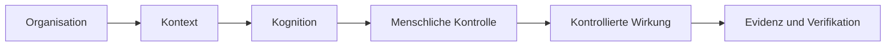

# UNITERA — Managementübersicht

**Disclosure:** PUBLIC_CORE · PUBLIC_ABSTRACTED · PUBLIC_STATUS

**Autorität:** keine aus sich selbst heraus

KI kann analysieren, entwerfen und automatisieren. Die schwierigere Frage ist,
wann KI-gestützte Arbeit verbindliche Realität werden darf. UNITERA trennt
deshalb Kontext, Kognition, Autorität, Wirkung und Nachweis.

*Conceptual public projection — not deployment, service, repository, protocol or security topology.*

## Öffentliches Nutzenversprechen

- Kontext wird nicht stillschweigend zu Erlaubnis.
- Modellfähigkeit wird nicht stillschweigend zu Autorität.
- Verbindliche Wirkung bleibt begrenzt, überprüfbar und zurechenbar.
- Persönliche Kontinuität und institutionelle Verantwortung bleiben getrennt.

Der kontrollierte Kern ist in Teilen materialisiert; die vollständige Product
Journey und Ende-zu-Ende-Produktionsreife werden nicht behauptet.
