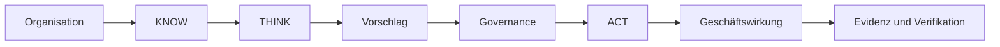

# UNITERA — Managementübersicht der Architektur

**Zielgruppe:** Partner, Kunden und technische Entscheider  
**Status:** PUBLIC PROJECTION  
**Autorität:** keine aus sich selbst heraus  
**Quellengrundlage:** aktuelle Refs der Owner-Repositories und abgeglichenes Architekturmaterial

## Das Problem

KI kann erzeugen, analysieren und automatisieren. Die schwierigere Frage lautet, **wann KI-gestützte Arbeit verbindliche geschäftliche Realität werden darf**.

UNITERA ist eine kontrollierte Intelligenzschicht zwischen Organisationskontext, KI-Kognition, menschlicher Autorität und externen Systemen.

## Drei Versprechen

### Kontext ohne stillschweigende Erlaubnis

Reicherer Organisationskontext wird nicht zu Ausführungsautorität.

### Kognition ohne stillschweigende Ausführung

Modelle dürfen analysieren, planen, simulieren und vorschlagen. Rechenleistung und Modellfähigkeit verleihen keine geschäftlichen Rechte.

### Ausführung mit Evidenz

Verbindliche Wirkungen durchlaufen Capability, Policy, erforderliche menschliche Kontrolle, Grant, Ausführung, Receipt, Verifikation und Abgleich.

## Warum das System getrennt ist

Foundation/Company Brain, providerneutrale Ausführungsverträge, Tenant-Autorität, Runtime-Implementierung, Registry-Referenzen und öffentliche Kommunikation besitzen unterschiedliche Owner. Diese Trennung verhindert, dass Produktoberfläche, Runtime-Paket oder Registry-Eintrag Autorität unbemerkt neu definieren.

## Aktueller Reifegrad

Der kontrollierte Kern ist substanziell: Company-Brain-Autorität, Execution-Control-Verträge, gehostete OIDC-Sessions, interne Identitäts-/Tenant-/Membership-Auflösung, begrenzte Kontrollen externer Wirkungen, Tenant-/Governance-Autoritätsnachweise und Registry-Erzwingung sind in ihren zuständigen Oberflächen materialisiert.

Die vollständige Product Journey ist nicht abgeschlossen. Self-Service-Sign-up, Profil und Tenant-Bootstrap sind offen; Discovery ist auf einem Entwicklungsbranch stark qualifiziert, jedoch nicht auf kanonischem `main`; die vollständige Cognition-Runtime-Autorität, ihr Lifecycle und die produktive End-to-End-Qualifikation bleiben offen.

Die präzise Beschreibung lautet daher: **ein materiell implementierter kontrollierter Kern mit teilweise integrierter Production Journey**.

