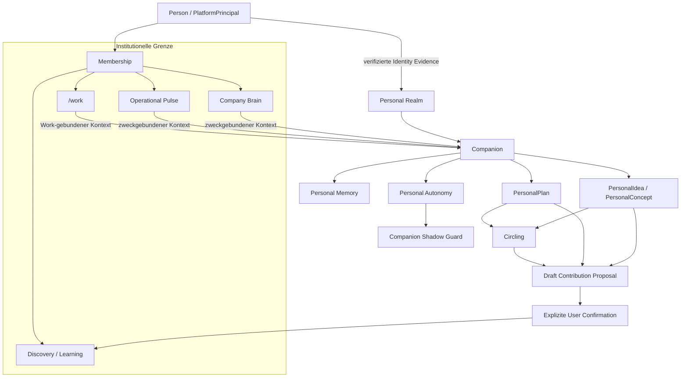

# Personal Realm, Companion, Personal Memory und Circling

**Status:** ÖFFENTLICHE PROJEKTION — OWNER-ENTSCHIEDENE ARCHITEKTUR; OWNER-REPO-FOUNDATION GEMERGED  
**Authority:** keine durch dieses Dokument  
**Owner Surface:** `baum777/unitera_companion`  
**Owner-main-Materialisierung:** `main@8dd8112a74631516c134bc3fc528d6220cdd27a7`, PR #1 gemerged  
**Cross-Repo Source Adoption:** ausstehend  
**Runtime Activation:** keine

Diese Seite supersediert die frühere öffentliche Candidate-Seite mit der Terminologie **Personal Domain / Member Companion**.

Die Owner-finalisierte Architektur nennt die first-class persönliche UNITERA-Kontinuitätsgrenze jetzt **Personal Realm**.

> **Das Company Brain erinnert das Unternehmen. Der Companion erinnert die Person. Circling bewahrt, was relevant werden könnte, bevor Commitment entsteht.**

## Source-Posture

Die 20-stufige Owner-Grill-Me-Finalisierung hat die Architekturrichtung entschieden und `unitera_companion` als dedizierte semantische Owner Surface festgelegt.

Die Owner-Materialisierung aus dem 20-stufigen Decision Set ist jetzt in `main` des designierten Owner-Repositories gemerged. Cross-Repo Adoption und Runtime Activation bleiben getrennte Gates. Daher unterscheidet diese öffentliche Seite:

~~~text
Owner Decision
= finalisiert

Owner-Repo-Architekturmaterialisierung
= auf Owner-main (`8dd8112`) gemerged

Cross-Repo Adoption
= ausstehend

Runtime / Production Activation
= nicht erfolgt
~~~

Die öffentliche Dokumentation erzeugt keine eigene Authority.

## Personal Realm

**Personal Realm** ist eine first-class, personengebundene Isolations-, Kontinuitäts- und Context-Domäne für eine dauerhafte UNITERA-Beziehung über Sessions, Geräte und organisatorische Memberships hinweg.

Sie ist keine institutionelle Authority Domain.

~~~text
PersonalRealm != CompanyTenant
PersonalRealm != Membership
PersonalRealm != PlatformPrincipal
PersonalRealm != Authority
~~~

Die früheren Begriffe gelten jetzt als:

~~~text
Personal Realm
= Owner-approved Preferred Term

Personal Domain
= Transition / Alternative Term

Personal Tenant
= historischer Working Term; für normative Nutzung nicht empfohlen
~~~

## Owner-Topologie

~~~text
unitera_companion
→ Personal-Realm-Semantik und Lifecycle
→ PersonalRealmBinding-Beziehung
→ Companion
→ Personal Memory
→ Circling
→ PersonalIdea / PersonalConcept / PersonalPlan
→ personal-side ContributionProposal
→ Personal Autonomy / Routine Binding
→ Shadow-Guard-Semantik
→ Personal-Realm-Backup / Transfer / Restore

Identity Authority
→ Person-/PlatformPrincipal-Identity-Evidence

Tenant Control Plane
→ Membership-/Company-Tenant-Beziehungen

coreos
→ institutionelle Discovery / Claim / Learning / Company Brain

unitera-os
→ provider-neutrale Capability-/Grant-/Execution-Contracts
~~~

Ein Repository-Pfad oder eine Runtime-Implementierung übernimmt keine Authority außerhalb des Concepts, das sie besitzt.

## Architektur auf einen Blick

Dieselbe Person kann an mehreren Company Tenants teilnehmen. Deren institutionelle Kontexte bleiben isoliert.

## Bootstrap und Local Runtime Node

Ein Personal Realm wird **nicht** automatisch bei Account-Sign-up erzeugt.

Die Owner-Richtung bindet den initialen Companion-Bootstrap an:

1. einen authentifizierten PlatformPrincipal;
2. einen erfolgreich gebundenen Local Runtime Node;
3. einen initialisierten lokalen UNITERA Workspace;
4. expliziten Companion Bootstrap.

~~~text
Local Node + Local Workspace
= Bootstrap-/Materialisierungsbedingungen

Local Node
!= Personal-Realm-Identität

Node Replacement
!= neues Personal Realm
~~~

## Local-first Persistenz und Multi-Node-Kontinuität

Das Personal Realm ist **local-first**.

~~~text
Primary Local Workspace
→ authoritative Working Materialization

Encrypted Remote Layer
→ Sync / Backup / Transport / Recovery Substrate
~~~

Der Remote Service ist weder Semantic Owner noch standardmäßig ein zentraler Plaintext-Personal-Store.

Ein Personal Realm kann mehrere Local Runtime Nodes binden.

Multi-writer-Synchronisierung ist erlaubt, aber semantische Bedeutung wird geschützt:

~~~text
mechanically safe / CRDT-safe Metadata
→ deterministischer Merge kann erlaubt sein

Semantic Content Conflict
→ beide Revisionen erhalten
→ explizite Reconciliation

last-write-wins
!= Default Semantic Conflict Policy
~~~

## Backup, Transfer und Recovery

Personal-Realm-Backups müssen **mit einem Hardware Key signiert** sein.

Normal Restore erfordert:

- gültigen Hardware-Key-Proof;
- gültiges Principal-/Person-Binding;
- Backup-Integrity-Verifikation;
- Binding des Target Local Runtime Node.

Account-Loss-Recovery nutzt einen separaten Break-Glass-Pfad:

~~~text
Hardware-Key-Proof
+ unabhängige Identity Re-Verification
+ explizite Recovery Procedure
→ neues/revidiertes PersonalRealmBinding
→ Restore
~~~

Harte Regel:

~~~text
HardwareKey != PersonIdentity
Backup Possession != RestoreAuthority
~~~

## Personal Memory

Personal Memory ist bewusst gespeicherte, nutzergebundene Kontinuitätsinformation.

Es ist weder Conversation History noch Runtime State oder institutionelle Wahrheit.

~~~text
Conversation / Observation
→ Memory Candidate
→ Memory Eligibility
→ retain | ask | transient | reject
→ Personal Memory
~~~

Die Owner-Richtung nutzt ein hybrides Governance-Modell:

- der Companion darf eligible Low-Risk-Continuity-Memory autonom behalten;
- sensible, unsichere, inferierte, identity-relevante, materiell folgenreiche, company-derived oder policy-restricted Memories brauchen stärkere Kontrolle;
- die Person muss Personal Memory einsehen, korrigieren, superseden, vergessen und exportieren können.

~~~text
ConversationHistory != PersonalMemory
PersonalMemory != RuntimeState
PersonalMemory != CompanyBrain
~~~

## Company-derived Personal Memory

Unternehmenskontext, den der Companion sehen darf, erhält nicht automatisch dauerhaftes Residency-Recht im Personal Memory.

~~~text
Company Context Access
!= Personal Memory Residency Permission
~~~

Dauerhaftes company-derived Memory benötigt eine **CrossBoundaryResidencyDecision**.

Mögliche Outcomes:

~~~text
RETAIN
TRANSFORMED_RETAIN
TRANSIENT_ONLY
DENY
~~~

Wenn die relevante Membership endet, muss retained company-derived Personal Memory erneut geprüft werden.

## Company-Zugriff auf Personal Memory

Die Owner-Entscheidung lautet **Default DENY**.

Ein Company Tenant erhält keinen Raw-Access auf Personal Memory.

Nur eine explizite **PersonalContextProjection** darf in den Company Context übergehen. Sie muss:

- explizit vom User autorisiert;
- an den exakten Destination Tenant gebunden;
- zweckgebunden;
- scope-begrenzt;
- zeitlich begrenzt;
- widerrufbar;
- provenienzbewahrend

sein.

~~~text
PersonalContextProjection != PersonalMemory
Projection != Company Ownership
Projection != Company Brain Truth
~~~

## Circling

Circling ist jetzt Owner-approved als **first-class Semantic Lifecycle/Relationship**, nicht als universelles Container-Objekt.

Sein Zweck bleibt:

~~~text
attention != commitment
~~~

Persönliche Objekte wie:

- PersonalIdea;
- PersonalConcept;
- Question;
- Pattern;
- Tension;
- Hypothesis;
- Opportunity;

können in eine Circling-Beziehung bzw. einen Circling-State eintreten.

~~~text
Circling != Priority
Circling != Commitment
Circling != WorkOrder
Circling != Claim
Circling != Decision
~~~

## Personal Ideation Grammar

Die Owner-approved Terminologie trennt:

~~~text
PersonalIdea
!= PersonalConcept
!= PersonalPlan
~~~

und:

~~~text
PersonalConcept != CanonicalConceptIdentity
PersonalConcept != Claim
PersonalPlan != WorkOrder
~~~

Eine mögliche Progression:

~~~text
Impulse
→ PersonalIdea
→ Circling / Development
→ PersonalConcept
→ Personal Evaluation
→ Landing
~~~

Landing kann zu PersonalPlan, Work Proposal, Discovery Contribution, BrainChangeProposal/LearningCandidate, Archive oder Discard führen. Landing bedeutet nie automatische Annahme durch das Zielsystem.

## Personal → institutionelle Contribution

Der Companion darf organisationale Relevanz erkennen und einen **Draft ContributionProposal** vorbereiten.

Er darf dieses Proposal nicht selbstständig über die Personal/Institutional Boundary einreichen.

~~~text
Personal Cognition
→ Companion bereitet ContributionProposal vor
→ EXPLIZITE USER CONFIRMATION
→ lifecycle-aware Institutional Command
~~~

Je nach aktuellem Company-Brain-Lifecycle kann der institutionelle Command sein:

- DiscoveryInput;
- CandidateChangeRequest;
- BrainChangeProposal / LearningCandidate.

~~~text
ContributionProposal != Claim
ContributionProposal != ClaimEligibility
ContributionProposal != Brain Activation
~~~

## Companion Autonomy

Die Owner-finalisierte Architektur lehnt einen undifferenzierten „Trust Score“ ab.

Intern bleiben getrennt:

~~~text
Relationship Familiarity
= wie gut der Companion die Person kennt

Qualification
= Evidenz zuverlässigen Verhaltens in einem definierten Scope

Global Autonomy Tier
= maximales qualitatives Delegation Ceiling

Capability-specific Delegation
= operative delegierte Autonomie

Effective Capability Tier
= aktuell runtime-attenuierte Autonomie
~~~

Harte Regel:

~~~text
effective capability tier
<= capability delegated tier
<= global Companion ceiling
~~~

Relationship Familiarity und Qualification dürfen Interpretation verbessern und Promotion Eligibility unterstützen. Sie erzeugen selbst keine Permission.

Die UI darf einen vereinfachten Relationship-/Trust-Indikator zeigen; diese Projektion bleibt rein informativ.

## Promotion und Attenuation

Within-tier bounded growth darf nur automatisch erfolgen, wenn:

- die Person die relevanten Bounds bereits autorisiert hat;
- Qualification die Erweiterung trägt;
- kein Hard-Safety-Failure vorliegt;
- keine neue Capability-/Effect-Class hinzukommt.

Cross-tier Promotion braucht immer explizite User Approval und eine neue Delegation Revision.

Runtime Attenuation oder Demotion darf automatisch erfolgen, auch capability-spezifisch.

## Companion Shadow Guard

Autonome effectful Companion Actions erhalten einen zusätzlichen **unabhängigen Shadow Guard**.

Der Guard besitzt zwei Ebenen.

### Deterministic Layer — immer aktiv

Prüft unter anderem:

- exaktes Realm-/Identity-Binding;
- Capability und Delegation;
- Target- und Payload-Bounds;
- Node-/Adapter-Binding;
- Expiry/Revocation;
- Hard Policy;
- Cross-Tenant-/Cross-Realm-Grenzen.

Diese Prüfungen werden niemals weg-gesampelt.

### Semantic Reasonableness Layer

Der unabhängige semantische Review prüft die geplante Handlung gegen:

- aktuellen User Intent;
- bekannte Routine;
- Target;
- Effect Magnitude;
- External Visibility;
- Destructiveness;
- Sensitivity;
- Novelty/Deviation.

Candidate Outcomes:

~~~text
PASS_EXISTING_PATH
FREEZE_PENDING_USER
DENY
ESCALATE
~~~

Ein Shadow PASS erzeugt niemals Authority.

### Tierabhängige Review-Dichte

~~~text
LOW AUTONOMY
→ Semantic Shadow Review für jede autonome effectful Action
→ mandatory fail-closed

HIGHER AUTONOMY
→ stark qualifizierte Low-Risk-Routinen dürfen in sampled Semantic Review wechseln

NOVEL / DEVIATING / SENSITIVE / ELEVATED-RISK
→ zurück zu FULL Semantic Review
~~~

Post-effect Verification bleibt separat:

~~~text
Dispatch
→ Receipt
→ Verification
~~~

Ambiguous Effects gehen in Reconciliation statt Blind Retry.

## Beispiele begrenzter persönlicher Autonomie

Low-Risk-Beispiele, die später unter exakter Delegation für autonome Ausführung qualifizieren können:

- Notes innerhalb eines exakt begrenzten Personal-Notes-Roots ergänzen oder bearbeiten;
- privaten Calendar Event erstellen;
- privaten Calendar Event innerhalb definierter Bounds korrigieren.

Technisch ähnliche Aktionen können semantisch völlig verschieden sein:

~~~text
privaten Reminder um 30 Minuten verschieben
!=
externes Meeting mit Teilnehmern verschieben
~~~

„Personal“ bedeutet nicht automatisch harmlos.

Höher-riskante Klassen wie Financial Transfer, Contract Acceptance, Security-/Identity-Mutation, Permission Escalation, destructive Mass Deletion, Cross-Tenant Transfer oder materielle Third-Party Commitments benötigen separat adoptierte Policy/Authority und entstehen nicht automatisch aus einem höheren Companion Tier.

## Beziehung zu /work

Die bestehende Product Direction bleibt für organisationale Operation **work-first, chat/Companion-secondary**.

~~~text
PersonalPlan != WorkOrder
Companion Thread != Work Object
Personal Realm != Company Tenant
~~~

Der Companion darf Work unterstützen, indem er eligible Personal Context mit least-sufficient tenant-bound Work- und Company-Kontext kombiniert. Er ersetzt weder `/work`, Company Brain noch institutionelle Authority.

## Aktueller öffentlicher Status

Die Owner Decisions für diese Architektur sind finalisiert und das Architekturfundament ist in `main` des designierten Owner-Repositories gemerged.

Diese öffentliche Seite behauptet **nicht**, dass:

- Cross-Repo Authority Bindings bereits adopted sind;
- eine Personal-Realm-Runtime bereits existiert;
- produktive Companion Effects aktiviert sind;
- der globale UNITERA Source Pointer geändert wurde;
- offene Privacy-/Legal-/Retention-Authority außerhalb der entschiedenen Architektur still geschlossen wurde.

Die nächsten Gates sind canonical Contract Materialization, exakte Cross-Domain Bindings, Persistence-/Crypto-Implementation-Profile, Negative Tests, Low-Risk-Effect-Pilots, Qualification, Cross-Repo Source Adoption und eine separate Production-Activation-Entscheidung.
