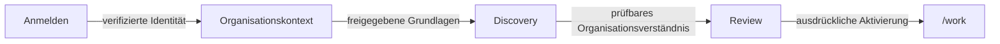

# Von der Anmeldung zur Discovery

Status: `PUBLIC_CORE`

Die öffentliche Journey beschreibt Produktverhalten, keine Authentisierungs- oder Service-Topologie.

Discovery hilft, Mission, Arbeitsweise, Grenzen, Quellen und offene Fragen nachvollziehbar zu erfassen. Ergebnisse bleiben prüfbar, bevor sie als aktiver institutioneller Kontext genutzt werden.

> Conceptual public projection — not deployment, service, repository, protocol or security topology.

---

[← Vorherige: Lokale und persönliche Vertrauensgrenze](../architecture/local-node-personal-realm-trust-boundary.md) · [Index](../README.md) · [Nächste: Discovery und Company Brain →](tenant-discovery-company-brain.md)
