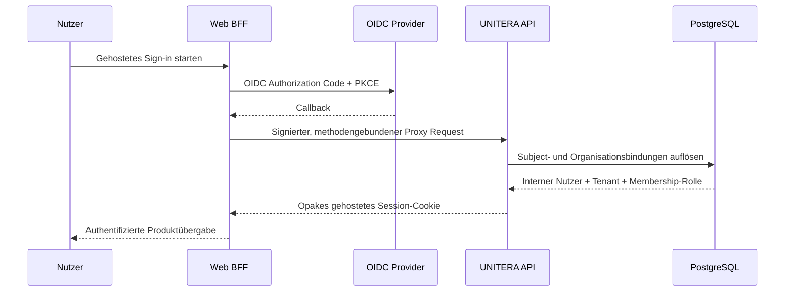
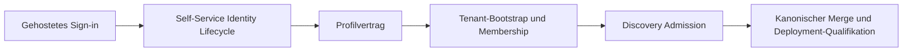

# Sign-up → Tenant → Discovery

**Status:** PUBLIC PROJECTION mit expliziten Implementierungslücken  
**Autorität:** keine aus sich selbst heraus  
**Quellengrundlage:** `Unitera_Systems/main@786d03c`, Discovery-Branch `7f7a3b3` und bereitgestellte Tenant-/Produkt-/Company-Brain-Quellen

## Vorgesehene Production Journey

```mermaid
flowchart TD
    V[Besucher] --> I[Gehostetes Sign-up oder Sign-in]
    I --> S[Opake gehostete Session]
    S --> P[Persönliches Profil]
    P --> T[Tenant-Bootstrap oder Auswahl]
    T --> M[Verifizierte Membership und Rolle]
    M --> F[First Contact]
    F --> D[Discovery Workspace]
    D --> C[Claims, Quellen, Konflikte, offene Entscheidungen]
    C --> R[Serverseitige Readiness]
    R --> B[Prüfung von Kandidat und exakter Revision]
    B --> A[Materialisierung und Aktivierung]
    A --> W[Erster beratender Work Order]
    W --> X[/work]
```

Dies ist die semantisch korrekte End-to-End-Journey. Sie ist **noch kein vollständig kanonischer Produktionsfluss**.

## Was auf `Unitera_Systems/main` kanonisch ist

Gehostete Authentifizierung ist materiell implementiert:



Die entscheidende Grenze lautet:

```text
externe OIDC-Identität
!= interner Nutzer
!= Tenant
!= Membership-Autorität
```

Externe Subject- und Organisationskennungen werden über bereitgestellte interne Bindungen aufgelöst. Rollen bleiben Membership-abgeleitet; die Tenant-bezogene Auflösung läuft unter PostgreSQL-Isolation.

## Was noch nicht kanonisch ist

Repository-Baum und Routenoberfläche belegen derzeit keine vollständige Self-Service-Kette für:

- öffentliche Kontoerstellung nach UNITERA-eigenen Lifecycle-Regeln;
- verpflichtenden Abschluss eines persönlichen Profils;
- sichere Tenant-Erstellung/-Auswahl und Begründung des Ownership;
- kontrollierte initiale Bereitstellung der Membership;
- kanonische Übergabe aus diesen Zuständen in Discovery.

Bereitschaft des gehosteten Sign-ins darf daher nicht als produktionsreife Sign-up-/Onboarding-Bereitschaft beschrieben werden.

## Implementierungsstatus von Discovery

Der Remote-Branch `codex/discovery-pilot-readiness-closure` liegt bei `7f7a3b35e957dafaf0d3cb11eb46c5788ddecdfe` derzeit 11 Commits vor und 0 hinter `Unitera_Systems/main`.

Er enthält einen qualifizierten Development Slice mit:

- Tenant-isolierter Discovery-Persistenz und Migration `0050`;
- API-Controller, Service, Repository und deterministischem Cognition Backend;
- `/work/discovery` und Session-UI-Routen;
- strukturiertem Wissen, Provenienz, Review und First-Work-Projektionen;
- Integrations-, Smoke-, Negativgrenzen- und Qualifikationsevidenz.

Der Branch weist Build, Migrationen, Governance, Premerge und eine Qualifikation mit 1.845 Tests und Datenbank aus. Da er nicht kanonisches `main` ist, bezeichnet dieses Repository ihn als **QUALIFIED DEVELOPMENT SLICE**, nicht als produktiv aktiv.

## Abschluss-Gates der Product Journey



Der produktionsreife Onboarding Slice ist erst geschlossen, wenn jeder Übergang einen zuständigen Vertrag, Fail-closed-Fehlerzustand, Tenant-Isolationsnachweis, Migrationspfad, Materialisierung auf kanonischem `main` und deployte End-to-End-Evidenz besitzt.

