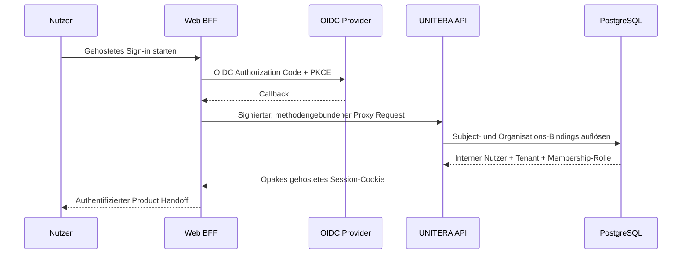

# Sign-up → Tenant → Discovery

**Status:** PUBLIC PROJECTION mit expliziten Implementierungslücken  
**Autorität:** keine aus sich selbst heraus  
**Quellengrundlage:** `Unitera_Systems/main@786d03c`, Discovery PR #94 bei `19e70f2`, Production Interface `main@d7cbf8c` und bereitgestellte Tenant-/Product-/Company-Brain-Quellen

## Vorgesehene Production Journey

```mermaid
flowchart TD
    V[Besucher] --> I[Gehostetes Sign-up oder Sign-in]
    I --> S[Opake gehostete Session]
    S --> P[Persönliches Profil]
    P --> T[Tenant-Bootstrap oder Auswahl]
    T --> M[Verifizierte Membership und Rolle]
    M --> F[First Contact]
    F --> D[Discovery Workspace]
    D --> C[Claims, Quellen, Konflikte, offene Entscheidungen]
    C --> R[Serverseitige Readiness]
    R --> B[Prüfung von Candidate und exakter Revision]
    B --> A[Materialisierung und Aktivierung]
    A --> W[Erster beratender Work Order]
    W --> X[/work]
```

Dies bleibt die semantisch korrekte End-to-End-Journey. Sie ist **noch kein vollständig kanonischer Produktionsfluss**.

## Kanonische Hosted-Auth-Grundlage

Gehostete Authentifizierung ist auf `Unitera_Systems/main` materiell implementiert:



Die entscheidende Grenze lautet:

```text
externe OIDC-Identität
!= interner Nutzer
!= Tenant
!= Membership-Autorität
```

Externe Subject- und Organisationskennungen werden über interne Bindings aufgelöst. Rollen bleiben Membership-abgeleitet; Tenant-bezogene Auflösung erfolgt serverseitig.

## Fortschritt des dedizierten Production Interface

Ein separates Implementierungs-Repository verbessert jetzt materiell den produktseitigen Teil dieser Journey:

```text
baum777/unitera-production-interface
main@d7cbf8c
role = B — PRODUCT_UI_PLUS_BFF
```

Sein gemergter PR #1 enthält den Migration-Closure-Stack und eine kontrollierte Settings-/Profile-Surface. Für den qualifizierten PR-Head wurde ein erfolgreicher Remote-CI-Run beobachtet.

Materialisierte produkt-owned Settings umfassen:

- Profilfelder;
- Preferences wie Interface-Sprache, Anrede, Kommunikationsstil und Zeitzone;
- Account-Projektion;
- Workspace-, Members- und Invitations-Projektionen;
- Expert/Admin-Runtime-Projektionen.

Die Grenze ist bewusst fail-closed:

```text
Profile Setting
!= Membership Role

Workspace Projection
!= Tenant Mutation

Member List
!= Role-Management Authority

Invitation UI
!= Invitation Command Authority

Company Brain Projection
!= Company Brain Mutation
```

Wo kein kanonischer Command verfügbar ist, bleiben Rollenmanagement und Invitation Actions deaktiviert/nicht verfügbar.

Damit wird eine **Product-Surface-Lücke** geschlossen. Der vollständige kanonische Self-Service-Onboarding-Lifecycle ist dadurch allein noch nicht bewiesen.

## Was End-to-End weiterhin nicht kanonisch ist

Die kombinierte Repository-Evidenz belegt weiterhin keine vollständig geschlossene Production-Self-Service-Kette für:

- öffentlichen Account-Lifecycle unter UNITERA-eigenen Regeln;
- sichere Tenant-Erstellung/-Auswahl und Ownership-Begründung;
- kontrollierte initiale Membership-Erzeugung;
- exakten Handoff aus diesen Zuständen in kanonisches Discovery;
- kanonischen Merge/Deployment der aktuellen Discovery Runtime;
- vollständigen Production-Proof von Activation zu First Work.

Hosted-Sign-in-Bereitschaft plus eine Product-Profile-Surface darf deshalb nicht als produktionsreifer Onboarding-Funnel beschrieben werden.

## Implementierungsstatus von Discovery

Discovery PR #94 zeigt aktuell auf:

```text
branch: codex/discovery-pilot-readiness-closure
head: 19e70f220a83c331b7fc7f4c9bbd9e3ff9d35893
relativ zu Unitera_Systems/main:
  ahead: 15
  behind: 0
state: OPEN / QUALIFIED DEVELOPMENT SLICE
```

Er enthält:

- Tenant-isolierte Discovery-Persistenz und Migration `0050`;
- API-Controller/-Service/-Repository und deterministisches Cognition Backend;
- `/work/discovery` und Session-UI-Routen;
- strukturiertes Wissen, Provenienz, Review und First-Work-Projektionen;
- RLS-, Integrations-, Smoke-, Negative-Boundary- und Qualifikationsevidenz.

Die PR-Qualifikation weist Build, Migration, Governance/Premerge sowie breite Unit-/Integration-Coverage aus. Weil der PR offen bleibt, bezeichnet dieses Repository ihn **nicht** als kanonisches main oder produktiv aktiv.

## Product-Integration-Review-Lane

Unitera_Systems PR #98 ist eine separate offene Integrations-Lane bei `903f025`.

Er ergänzt einen Read-only Pilot-/Product-Shell und materialisiert in diesem Stack Natural-Person-Identity/Attestation, HumanDecision/DualControlSet sowie umfassendere Work Read Models.

Alle fünf beobachteten Remote-Workflow-Familien sind auf genau diesem Head erfolgreich.

Für die Journey stärkt das:

```text
Identity Assurance
→ Decision/Dual-Control Representation
→ Authority-aware Work Projection
→ Product Entry
```

bleibt aber:

```text
qualifizierter offener PR
!= kanonisches main
!= Production Activation
```

## Abschluss-Gates der Product Journey


Der produktionsreife Onboarding Slice ist erst geschlossen, wenn jeder Übergang einen zuständigen Vertrag, Fail-closed-Fehlerzustand, Tenant-Isolationsnachweis, Migrationspfad, kanonische Materialisierung und deployte End-to-End-Evidenz besitzt.

## Aktuelle Nichtaussagen

Diese Seite behauptet nicht:

- dass `unitera-production-interface` Identity-, Membership- oder Tenant-Semantik besitzt;
- dass der Profile-/Settings-Merge den öffentlichen Self-Service-Tenant-Bootstrap schließt;
- dass Discovery PR #94 gemerged ist;
- dass Product Integration PR #98 kanonisch ist;
- dass Live Effects oder Production Execution aktiv sind;
- dass der Pilot Owner Freeze autorisiert ist.
