# Tenant, Discovery und Company Brain

**Status:** PUBLIC PROJECTION  
**Autorität:** keine aus sich selbst heraus  
**Quellengrundlage:** `coreos/main`, `Unitera_Systems/main`, qualifizierter Discovery-Branch und bereitgestellte Phase-1-/Produktquellen

Der Tenant ist die institutionelle Sicherheits- und Autoritätsgrenze. Authentifizierung begründet eine Identity Session; sie erzeugt weder Tenant-Ownership noch Membership oder Company-Brain-Autorität.

Discovery ist **unterstützte organisationale Sinnbildung**. Konversation ist ein Eingangskanal; das Produktobjekt ist prüfbares Organisationswissen.

```mermaid
flowchart LR
    D[Discovery-Eingabe] --> E[Evidenz und Quellen]
    E --> C[Claims]
    C --> Q[Eignung und Review]
    Q --> CR[Kandidatenrevision]
    CR --> AP[Freigabe des exakten Digests]
    AP --> MR[Unveränderliche Brain-Revision]
    MR --> AM[Aktivierungsmanifest]
    AM --> TB[Atomares TenantBrainBinding]
    TB --> W[Erster beratender Work Order]
```



## Epistemische Zustände

- `founder_confirmed`
- `document_supported`
- `observed`
- `assumption`
- `unresolved`
- `conflicting`

Harte Grenzen:

```text
Message != Claim
Claim != Active Institutional Truth
Candidate != Active Brain
Approval != Activation
Activation != Execution Authority
```

## Readiness und Review

Readiness bedeutet, dass ausreichend zugeordnete Struktur für einen prüfbaren Kandidaten vorhanden ist. Sie bedeutet weder vollständige organisationale Wahrheit noch null Annahmen oder Konflikte. Materielle neue Evidenz kann `candidate_ready` für eine neue serverseitige Bewertung wieder öffnen; nicht jede Nachricht ist materiell.

## Produktrichtung

Die abgeglichene Richtung bleibt **work-first, chat-secondary**:

- `/work` ist die primäre Arbeitsoberfläche;
- Chat unterstützt Work-Order-kontextbezogen oder global Tenant-gebunden;
- Company-Brain-Kontext ist einsehbare Infrastruktur, nicht die Behauptung, die UI selbst sei der Truth Store;
- bei Qualifikation wird genau ein begrenzter beratender erster Work Order durch vertrauenswürdige Eligibility und deterministisches Ranking ausgewählt;
- ohne geeignetes Objekt erscheint ein ehrlicher Leerzustand statt erfundener Priorität.

## Implementierungsstatus

`coreos` besitzt das Company-Brain-Autoritätsmodell und die aktive Foundation-Baseline. `Unitera_Systems/main` enthält Company-Brain-Consumption und Authority-Runtime-Oberflächen. Die vollständige aktuelle Discovery Runtime und `/work/discovery` sind auf einem nichtkanonischen Branch qualifiziert; kanonischer Merge und Deployment-Qualifikation bleiben getrennte Gates.

