# Governance — Öffentliche Dokumentationsprojektion

## Klassifikation

- repository_role: `PUBLIC_DOCUMENTATION_PROJECTION`
- authority: `NONE_BY_ITSELF`
- registry_role: `CONSUMER_OF_VERIFIED_REFERENCES`
- may_activate_source: `false`
- may_create_runtime_authority: `false`
- may_create_tenant_authority: `false`
- may_create_capability_or_grant: `false`

## Vorrangfolge

Bei widersprüchlichen Informationen gilt diese Auslegungsreihenfolge:

1. Verifiziertes kanonisches Artefakt im zuständigen Owner-Repository.
2. Eingefrorene Phasen- oder Vertragsspezifikation.
3. Evidenz einer Owner-Entscheidung vor formaler Adoption.
4. Architektur- oder Quellenkandidat.
5. Produkt-/UX-Projektion.
6. Veraltetes oder rein konversationelles Material.

Diese Reihenfolge ist eine Bewertungsregel für die Dokumentation. Sie erzeugt keine neue Autoritätsschicht.

## Publikations-Gate

Eine öffentliche Aussage darf nur dann als `ESTABLISHED` oder `MATERIALIZED` markiert werden, wenn ihre Quellengrundlage dies trägt. Kandidaten müssen sichtbar `CANDIDATE` bleiben. Offene Lücken dürfen in der Dokumentation nicht stillschweigend geschlossen werden.

## Aktualisierungsfluss

```mermaid
flowchart LR
    A[Änderung der Owner-Quelle] --> B[Prüfung im Owner-Repository]
    B --> C[Tests und Konformitätsevidenz]
    C --> D[Registry- und Supersession-Abgleich]
    D --> E[Digest- und Provenienzaktualisierung]
    E --> F[Owner-Freeze oder Freigabe, falls erforderlich]
    F --> G[Pointer-Prüfung, falls anwendbar]
    G --> H[Aktualisierung der öffentlichen Projektion]
```

**Eine Adoption beginnt niemals mit einer Änderung der öffentlichen Dokumentation oder des aktuellen Source Pointers.**

