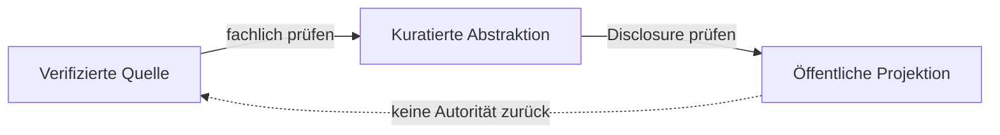

# Governance — Öffentliche Dokumentationsprojektion

**Disclosure:** PUBLIC_ABSTRACTED
**Autorität:** keine aus sich selbst heraus

Diese Dokumentation folgt vier Regeln:

- Zuständige, verifizierte Quellen gewinnen bei Widerspruch.
- Kandidaten bleiben Kandidaten, bis sie außerhalb dieser Dokumentation
  ordnungsgemäß adoptiert wurden.
- Öffentliche Reifegrade bleiben grob und langsamer als Engineering-Status.
- Veröffentlichung erzeugt keine Autorität, Erlaubnis oder Aktivierung.

*Conceptual public projection — not deployment, service, repository, protocol or security topology.*

Offene Lücken werden benannt und nicht durch Dokumentation geschlossen.
