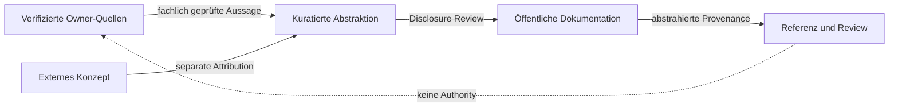

# Von Quellen zur Publikation

Status: `PUBLIC_ABSTRACTED`

Referenzierung macht Herkunft und Review nachvollziehbar, ohne interne Topologie zu veröffentlichen oder Authority zu erzeugen.

> Conceptual public projection — not deployment, service, repository, protocol or security topology.

---

[← Vorherige: Pilot und Produktionsreife](../status/pilot-production-readiness.md) · [Index](../README.md) · [Nächste: Dokumentations- und Diagrammkonventionen →](../style/documentation-and-diagrams.md)
