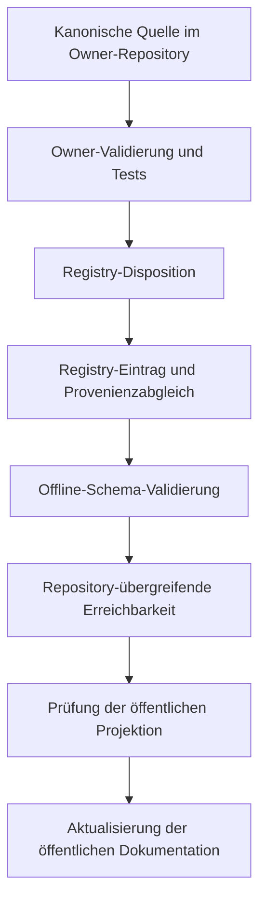

# Registry → öffentliche Publikation

**Status:** PUBLIC PROJECTION  
**Autorität:** keine aus sich selbst heraus  
**Quellengrundlage:** `unitera-registry/main@a2f4cca` und lokale Publikations-Governance dieses Repositories

Die Registry ist ein Repository-übergreifender Index für Quellen, Autoritätsreferenzen, Provenienz, Adoption, Supersession, Consumer und Implementierungsbindungen. Ihr Bootstrap-Schema ist `1.1.0`.



## Aktueller Erzwingungsstatus

Registry `main` verlangt zwei getrennte Prüfungen:

- Offline-Validierung der Registry;
- Repository-übergreifende Erreichbarkeit.

Das verbessert die Integrität der Referenzen. Es macht die Registry weder zu einer Autoritätsquelle noch beweist es Runtime-Verhalten.

## Disposition-Regel

Owner-Repositories klassifizieren die Registry-Auswirkung vor dem Abschluss:

| Disposition | Bedeutung |
|---|---|
| `NO_CHANGE` | Keine adoptierte Registry-relevante Klasse wurde geändert. |
| `UPDATED` | Erforderliche Registry-Änderung wurde abgeschlossen und durch ihren Commit belegt. |
| `REQUIRED_BUT_BLOCKED` | Eine erforderliche Registry-Aktualisierung konnte nicht abgeschlossen werden. |

## Fail-closed-Publikationsregel

Nicht mit einem Pointer-Wechsel beginnen. Kandidaten- oder Branch-Material darf nicht als kanonisch publiziert werden, nur weil es in einem Registry-Paket erscheint. Zuerst erfolgen Owner-Materialisierung und Verifikation, dann der Registry-Abgleich und zuletzt die öffentliche Projektion.

```text
Registry reachability != source authority
Registry record != production activation
Implementation binding != runtime qualification
Public projection != backflow authority
```

