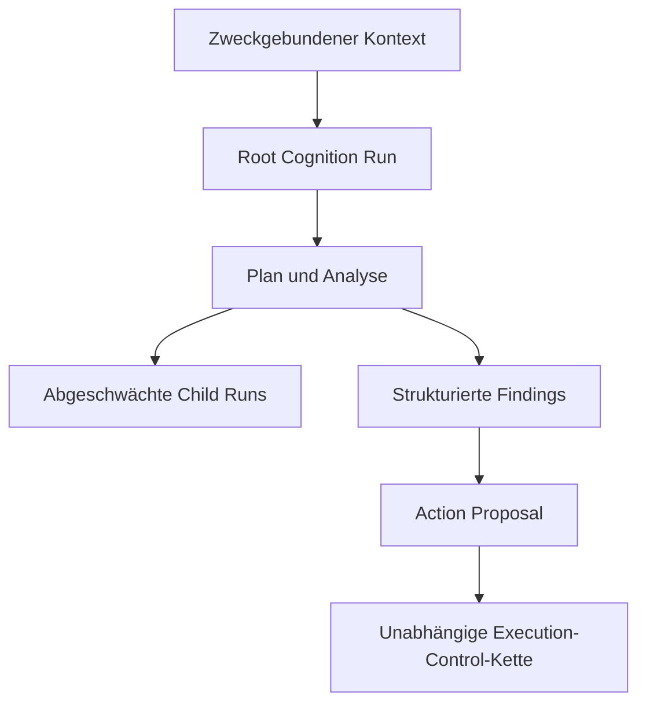

# Cognition Runtime

**Status:** PARTIALLY MATERIALIZED / OPEN RUNTIME GATES  
**Autorität:** keine aus sich selbst heraus  
**Quellengrundlage:** `Unitera_Systems/main@786d03c`, abgeglichenes KNOW-/THINK-/ACT-Material und nichtkanonische Cognition-Gate-Evidenz

UNITERA behandelt Kognition als Rechenleistung, nicht als Autorität.



## Auf kanonischem `main` materialisiert

Der v1-Domänenvertrag des Cognition Compute Envelope und der Schutz der Token-Abrechnung sind materialisiert. Der Vertrag trennt:

```text
cognitive capability
× compute envelope
× delegated/effective autonomy
× execution authority
```

Mehr Tokens, Tiefe, Child Runs oder Modellfähigkeit erzeugen keine zusätzliche Autorität.

## Weiterhin offen

Kanonisches `main` belegt noch nicht den vollständigen produktiven Cognition-Runtime-Lifecycle. Verbleibende Gates umfassen:

- konkrete Root-Run-Autorisierung und Admission-Bindung;
- dauerhafte Run-Identität und Lifecycle-Zustand;
- Semantik für Nebenläufigkeit sowie Reservierung und Verbrauch von Budgets;
- Klassifikation von Zustand, Memory, Kontext, Aufbewahrung und Evidenz;
- Abschwächung von Child Runs und erneute Prüfung vor dem Spawn;
- produktive Backend-Bindung und operative Qualifikation.

Nichtkanonische Owner-Pakete beschreiben mehrere dieser Entscheidungen. Dokumentation kann sie jedoch nicht zu kanonischer Runtime-Autorität erklären.

## Child-Run-Invariante

```text
child.tenant == parent.tenant
child.scope ⊆ parent.scope
child.capability_surface ⊆ parent.capability_surface
child.expiry <= parent.expiry
child.compute <= reserved parent budget
child.autonomy <= parent.autonomy
```

Neuplanung darf den Weg ändern. Sie darf Tenant-, Ziel-, Capability-, Autonomie- oder Autoritätsgrenzen nicht erweitern.

## Evidenzstatus

Sicherheitsevidenz sollte Run-Identität, Kontext-Digest, Modellantwort-Digest, Proposal-Digest, Policy-Snapshot und Lineage binden. Vollständige private Reasoning-Transkripte sind standardmäßig nicht als Autoritätsnachweis erforderlich.
## Pilot-Modellwahl und Routing

Die aktuelle Pilot-Arbeitsrichtung dokumentiert statische, profilgebundene Modellbindungen über einen OpenRouter-Cognition-Adapter sowie explizite High-Assurance-Review-Runs. Ein freier Dynamic Model Router bleibt in diesem Pilotkonzept deaktiviert. Details: [Pilot-Modellwahl, OpenRouter und kontrolliertes Routing](pilot-model-routing-openrouter.md).
