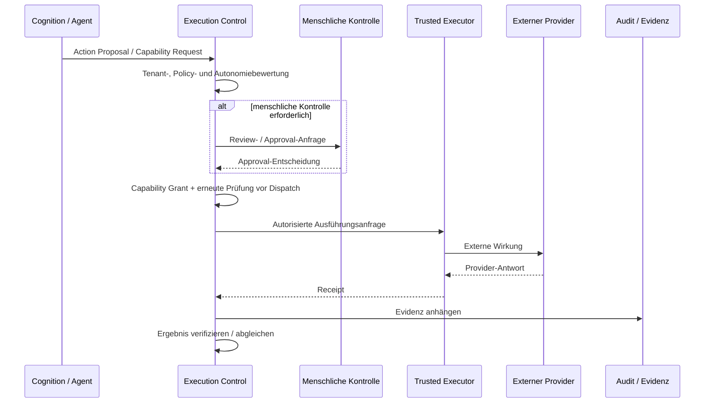

# Kontrollierte externe Wirkung

**Status:** ESTABLISHED architecture; exakte Runtime-Verfügbarkeit hängt von der zuständigen Implementierungsoberfläche ab.

UNITERA trennt Approval, Grant, externe Ausführung, Receipt und Verifikation. Externe Wirkungen dürfen nicht direkt aus der Cognition heraus ausgeführt werden.

## v1-Wirkungsgrenze

Die etablierte technische Referenz für die einzelne begrenzte externe v1-Capability ist `email.send.commit`. Um sie herum können umfassendere Geschäftsabläufe komponiert werden; Namen von Workflows dürfen jedoch nicht stillschweigend zu neuen atomaren Capabilities werden.

## Fehlerregel

Ein unbekanntes externes Ergebnis ist keine Erlaubnis für einen blinden Retry. Das System muss unsichere Wirkungen abgleichen, bevor es entscheidet, ob ein weiterer Versuch sicher ist.

