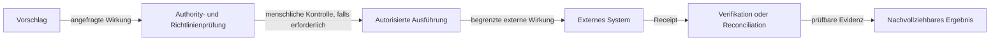

# Kontrollierte Wirkung

Status: `PUBLIC_CORE`

Approval ist nicht Ausführung, Receipt ist nicht Verifikation und ein unbekanntes Ergebnis ist keine Einladung zum blinden Retry. Reale Wirkung bleibt absichtlich eng begrenzt.

> Conceptual public projection — not deployment, service, repository, protocol or security topology.

---

[← Vorherige: Modell- und Provider-Unabhängigkeit](model-and-provider-independence.md) · [Index](../README.md) · [Nächste: Lokale Runtime-Grenze →](local-runtime-node.md)
