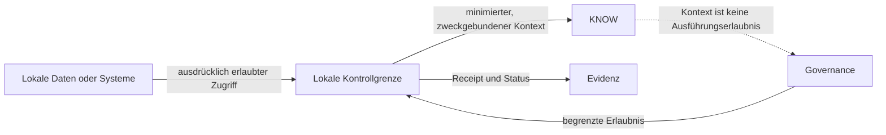

# Lokale Runtime-Grenze

Status: `PUBLIC_ABSTRACTED`

Eine lokale Runtime-Grenze kann freigegebene lokale Ressourcen oder Systeme für UNITERA erreichbar machen. Erreichbarkeit allein erlaubt weder Lesen noch Ausführen.

Lokale Souveränität bedeutet kontrollierte Nähe zu Daten und Wirkung, nicht universellen Zugriff. Details zu Transport, Identität, Credentials und Enforcement bleiben in internen Owner-Quellen.

> Conceptual public projection — not deployment, service, repository, protocol or security topology.
