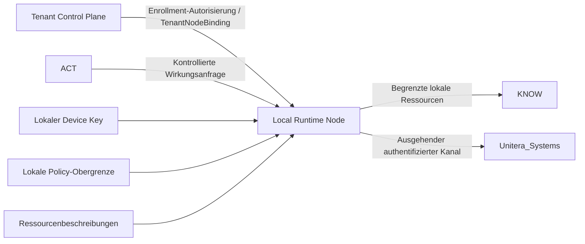

# Local Runtime Node

**Status:** CANDIDATE — durch dieses Dokument weder Repository-kanonisch noch source-adoptiert oder Runtime-aktiv.

Der Local Runtime Node ist eine vorgeschlagene Erweiterung der Deployment- und Vertrauensgrenze für kontrollierten Zugriff auf den physischen Rechner eines Tenants. Er ist **keine vierte KNOW-/THINK-/ACT-Ebene**.

Kandidat für die Sicherheitsausrichtung:

- explizite Enrollment-Autorisierung
- lokal erzeugter asymmetrischer operativer Schlüssel
- Besitznachweis
- separates TenantNodeBinding
- kurzlebiger ausgehender Kanal
- lokale Policy-Obergrenze
- keine impliziten Ressourcen, Adapter oder Grants beim Enrollment
- optionale Hardware-Attestation als zusätzliche Absicherung

**Lokalität kann Datenbewegungen verringern; sie erzeugt aus sich heraus weder Vertrauen noch Erlaubnis.**

