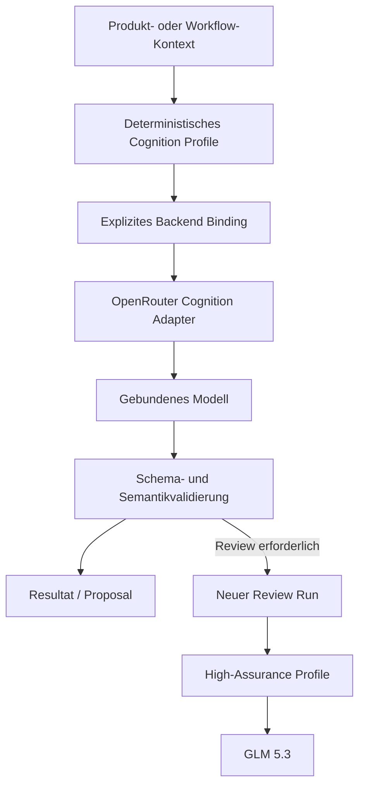
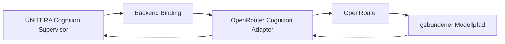
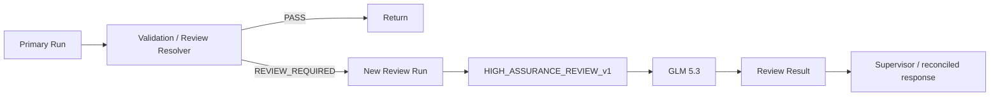
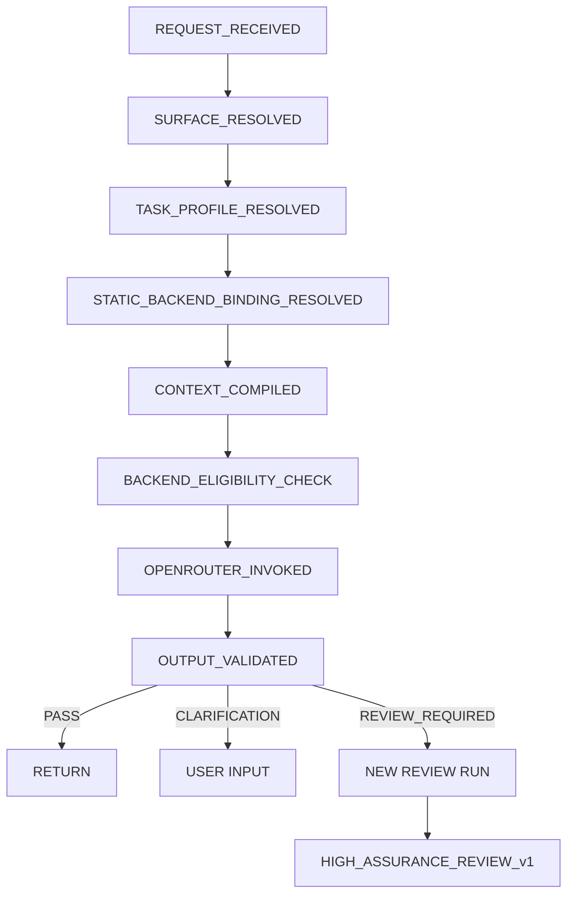
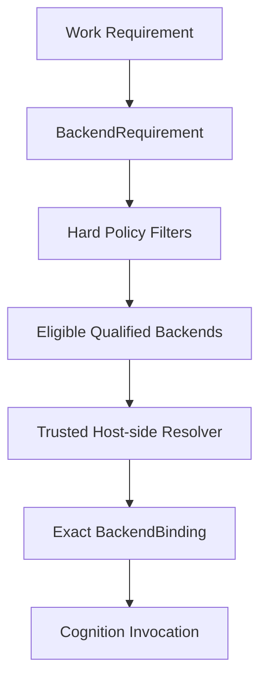

# Pilot-Modellwahl, OpenRouter und kontrolliertes Routing

**Status:** PUBLIC PROJECTION | CANDIDATE / PILOT WORKING PLAN  
**Autorität:** keine aus sich selbst heraus  
**Stand:** 30.08.2026  
**Quellengrundlage:** abgeglichene Runtime-/KNOW-/THINK-/ACT-Sources, Backend-Agnostic-Processing-Candidate, Open-Weights-Long-Term-Plan sowie datierte Pilot-Benchmark-Evidenz  
**Wichtig:** Die hier beschriebenen Modellbindungen sind Pilotentscheidungen. Sie sind weder Source-of-Truth-Authority noch eine Aussage über allgemeine Modellüberlegenheit.

UNITERA behandelt Modellwahl als **Cognition Runtime Concern**, nicht als Autoritätsentscheidung.

Der Pilot verfolgt deshalb zwei Ziele gleichzeitig:

1. für verschiedene kognitive Aufgaben jeweils ein geeignetes Modell verwenden;
2. dabei verhindern, dass Modellwahl, Provider, Routing oder ein Modelloutput zusätzliche institutionelle Autorität erzeugen.

Die Kernregel lautet:

```text
Model Selection != Authority
Provider Selection != Authority
Model Output != Institutional Truth
Model Qualification != Capability Grant
Higher Model Capability != Higher Autonomy
```

---

## 1. Pilotentscheidung

UNITERA führt im Pilot **keinen freien Dynamic Model Router** ein.

Stattdessen wird jede bekannte Produktsituation deterministisch einem Cognition Profile zugeordnet. Dieses Profile besitzt eine explizite, statische Backend-Bindung.



Damit gilt im Pilot:

```text
known context
→ known profile
→ known model binding
```

Nicht:

```text
prompt
→ model chooses "best model"
→ arbitrary route
```

---

## 2. Aktuelles Pilotportfolio

| Cognition Profile | Arbeitsbindung im Pilot | Rolle |
|---|---|---|
| `DISCOVERY_v1` | **Qwen 3.8 Max** | strukturierte Discovery und organizational sensemaking |
| `GRILL_ME_v1` | **DeepSeek V4 Flash 0731** | kritische Gegenprüfung von Schlussfolgerungen und Empfehlungen |
| `CHAT_ASSIST_v1` | **DeepSeek V4 Flash 0731** | täglicher globaler, tenantgebundener Assistant |
| `WORK_ASSIST_v1` | **DeepSeek V4 Flash 0731** | Work-Object-gebundene Kognition |
| `HIGH_ASSURANCE_REVIEW_v1` | **GLM 5.3** | tiefe Review- und Eskalationsroute |
| `SHADOW_CHALLENGER_v1` | **Tencent HY3** | Shadow-Evaluation, nicht user-facing |

Diese Bindungen sind **Profile-spezifisch**. UNITERA qualifiziert nicht „das beste Modell“, sondern eine Kombination aus:

```text
Model
× Harness Revision
× Task Profile
× Runtime Configuration
```

Ein Modell kann deshalb in einem Profile führend sein und in einem anderen nur Challenger oder Shadow-Kandidat.

---

## 3. Warum diese Verteilung?

Die Pilotentscheidung basiert auf den bis 30.08.2026 durchgeführten Discovery- und Grill-Me-Vergleichen.

### Discovery

Die wiederholten Multi-Case-Runs zeigten:

- **GLM 5.3** als Qualitätsreferenz mit sehr hoher semantischer Stabilität, aber deutlich höherer Laufzeit;
- **DeepSeek V4 Flash** mit sehr hoher Qualität und häufig niedrigerer Latenz, jedoch höherer Laufzeitvarianz;
- **Qwen 3.8 Max** als besonders attraktiven interaktiven Discovery-Kandidaten, weil Qualität, Latenz und Stabilität ausgewogen waren;
- kleinere/schnellere Qwen-Varianten als Fast-Path-Kandidaten, aber mit beobachteten semantischen Risiken bei Currentness, Supersession und Responsibility-Elevation.

### Grill-Me

In den ersten drei breiten Grill-Me-Fällen ergab sich als Arbeitsbild:

| Modell | kumulative Qualität | beobachtete Runtime-Tendenz | Arbeitsrolle |
|---|---:|---|---|
| GLM 5.3 | höchste | langsam | Quality / Assurance Reference |
| DeepSeek V4 Flash | sehr hoch | schnell bis mittel | Balanced Leader |
| Tencent HY3 | hoch | schnell bis mittel | Shadow Challenger |
| Qwen 3.8 Max | hoch, aber variabler | mittel | High-Variance Challenger |

Diese Zahlen und Einordnungen sind **datierte Evaluations-Evidenz**, keine dauerhafte Modellrangliste. Ein Modellwechsel oder eine neue Version erfordert erneute profilbezogene Evaluation.

---

## 4. Product Mapping

Die Modellarchitektur folgt der Produktsystematik.

```text
Discovery
→ DISCOVERY_v1
→ Qwen 3.8 Max

/work + aktives Work Object
→ WORK_ASSIST_v1
→ DeepSeek V4 Flash

globaler Assistant
→ CHAT_ASSIST_v1
→ DeepSeek V4 Flash

explizites Grill-Me
→ GRILL_ME_v1
→ DeepSeek V4 Flash

materielle / komplexe Review-Anforderung
→ HIGH_ASSURANCE_REVIEW_v1
→ GLM 5.3

Shadow-Sampling
→ SHADOW_CHALLENGER_v1
→ Tencent HY3
```

Dass Work und Chat dasselbe Modell verwenden können, bedeutet nicht, dass sie dasselbe Verhalten besitzen. Ihre Unterschiede liegen in:

- Harness;
- Context Policy;
- Output Contract;
- Work-/Tenant-Bindung;
- Compute Envelope;
- Failure-/Escalation-Policy.

```text
same model
!=
same cognition profile
```

---

## 5. OpenRouter im Pilot

OpenRouter wird als **Cognition Backend Gateway / Provider Adapter** behandelt.

Es ist nicht:

- UNITERA Capability;
- Authority;
- Policy Engine;
- Workflow Engine;
- Company Brain;
- Execution Adapter für Geschäftswirkungen.



Die semantische Schicht bleibt providerneutral. OpenRouter ist eine konkrete Runtime-Implementierung hinter dem Binding.

---

## 6. OpenRouterCognitionAdapter

Der Pilot soll keinen modellbezogenen Service-Wildwuchs erzeugen.

Bevorzugt ist ein providerneutrales Interface:

```ts
interface CognitionBackendAdapter {
  invoke(request: CognitionInvocation): Promise<CognitionResult>
}

interface OpenRouterCognitionAdapter extends CognitionBackendAdapter {
  providerId: "openrouter"
}
```

Nicht bevorzugt:

```text
QwenDiscoveryService
DeepSeekChatService
GLMReviewController
```

Sondern:

```text
Cognition Profile
→ Backend Binding
→ CognitionBackendAdapter
```

So bleibt ein späterer Wechsel zu einem anderen Gateway, lokalem Open-Weights-Inference oder dediziertem Compute möglich, ohne Product-/Authority-Semantik neu zu definieren.

---

## 7. Cognition Profile

Ein Cognition Profile bindet die fachliche Laufzeitkonfiguration.

Candidate-Struktur:

```yaml
CognitionProfile:
  profile_id:
  profile_version:
  purpose:
  task_class:

  harness_ref:
  harness_digest:

  context_policy_ref:
  output_contract_ref:

  compute_envelope_ref:
  failure_policy_ref:

  backend_requirement_ref:
```

Wichtig:

```text
Harness Revision
!= Model Identity

Compute Envelope
!= Provider Parameter Syntax

Profile
!= Authority
```

---

## 8. Backend Binding

Ein Pilot-Backend-Binding beschreibt die konkrete Runtime-Route für genau ein Profile.

```yaml
BackendBinding:
  binding_id:
  profile_id:

  backend_class: language_model_cognition

  gateway:
    provider: openrouter

  model:
    family:
    implementation_identifier:

  request_profile_ref:
  runtime_configuration_digest:

  evaluation_profile_ref:
  qualification_ref:

  status:
```

Der konkrete OpenRouter-Modell-Identifier ist Runtime-Konfiguration und muss vor Aktivierung verifiziert werden. Er wird nicht durch Produktdokumentation kanonisch.

Hard Rules:

```text
BackendRequirement != BackendBinding
Backend Availability != Backend Eligibility
Backend Eligibility != Permission
Backend Change != Authority Change
```

---

## 9. Zwei verschiedene Routing-Ebenen

Bei OpenRouter müssen zwei Dinge getrennt bleiben.

### UNITERA Model Routing

Frage:

> Welches qualifizierte Cognition Profile und Modell ist für diesen UNITERA-Task vorgesehen?

### Provider Routing

Frage:

> Über welche konkrete technische Serving-Route wird dieses Modell ausgeführt?

```text
UNITERA profile/model resolution
!=
OpenRouter upstream provider resolution
```

Für den Pilot ist die bevorzugte Arbeitsregel:

- den Modellpfad explizit binden;
- Provider-/Serving-Metadaten erfassen;
- unkontrollierte stille Modellsubstitution vermeiden;
- Provider-Fallback nur dann zulassen, wenn er selbst qualifiziert und policy-konform ist.

Dadurch bleibt reproduzierbar, was tatsächlich evaluiert und was tatsächlich ausgeführt wurde.

---

## 10. Keine stille Eskalation

Eine besonders wichtige Grenze ist die Eskalation auf GLM.

### Nicht zulässig

```text
DeepSeek läuft
→ Antwort wirkt unsicher
→ Runtime ersetzt still durch GLM
→ Nutzer sieht nur Endantwort
```

### Pilotkonform



Das erzeugt:

```text
Run A
+
Run B
+
explizite Lineage
```

und nicht eine unsichtbare Backend-Substitution.

---

## 11. Candidate-Eskalationsregeln

Ein hostseitiger Resolver kann einen High-Assurance-Review auslösen bei:

- materiellem Konflikt zwischen Sources oder Claims;
- authority-sensitiver Interpretation;
- komplexer quantitativer Mehrschrittprüfung;
- kausalen Schlussfolgerungen mit mehreren Confoundern;
- strategischer Empfehlung mit hoher Tragweite;
- Ergebnis mit unresolved material contradiction;
- Output-Contract-Verletzung, wenn eine einfache bounded Repair nicht genügt;
- explizitem Grill-/Review-Modus.

Nicht ausreichend als alleiniger Trigger:

- hohe Tokenzahl;
- lange Eingabe;
- „wichtiger“ Ton des Nutzers;
- Modell behauptet selbst, ein anderes Modell sei nötig;
- Modell-Confidence allein;
- Provider empfiehlt einen anderen Route.

```text
model route suggestion
!= route authority
```

---

## 12. Daily Chat und Work

### `CHAT_ASSIST_v1`

Zweck:

- allgemeine tenantgebundene Assistenz;
- Erklärung;
- Entwurf;
- Planung;
- Rückfragen;
- Context-sensitive Unterstützung.

Context kann enthalten:

- aktuelle Conversation;
- relevante Company-Brain-Projektion;
- ausdrücklich aufgelöste Resources;
- geeignete Operational-Pulse-Signale.

Output bleibt:

```text
answer
clarification
recommendation
proposal
```

und besitzt keine eigene Authority.

### `WORK_ASSIST_v1`

Zweck:

- Reasoning über ein konkretes Work Object;
- Zusammenfassung;
- nächste Schritte;
- Drafts;
- Konflikt-/Evidence-Analyse;
- Action-Proposal-Vorbereitung.

Context bindet zusätzlich:

- Work Object;
- Workflow State;
- relevante Evidence;
- Authority Context;
- Open Decisions;
- Conflicts.

```text
Work Assistant
!= Workflow Authority
```

---

## 13. Discovery Profile

`DISCOVERY_v1` soll organisatorische Inputs strukturieren.

Typische Ableitungen:

```text
Input / Conversation
→ Claims
→ Ambiguities
→ Conflicts
→ Authority Findings
→ Clarification Question
```

Die bestehende Company-Brain-Grenze bleibt erhalten:

```text
Message != Claim
Claim != Active Institutional Truth
Model Output != Claim Inclusion Authority
```

Das Modell darf strukturieren und vorschlagen. Trusted Policy, Review und der Company-Brain-Lifecycle entscheiden über institutionelle Konsequenz.

---

## 14. Grill-Me Profile

`GRILL_ME_v1` ist bewusst kritischer als der Daily Mode.

Es prüft insbesondere:

- supported parts;
- unsupported inferential steps;
- hidden assumptions;
- counter explanations;
- quantitative mismatches;
- causality;
- currentness / supersession;
- authority or scope failures;
- strongest surviving conclusion.

Das Ziel ist nicht, Einwände um ihrer selbst willen zu erzeugen, sondern eine überzogene Schlussfolgerung auf die stärkste noch tragfähige Aussage zurückzuführen.

```text
Daily Assistant
= helpful by default

Grill-Me
= deliberate adversarial review
```

---

## 15. High-Assurance Review

GLM 5.3 wird nicht als Default-Chat-Modell behandelt.

Der Pilot reserviert es für Fälle, in denen zusätzliche Review-Tiefe ihren Laufzeitpreis rechtfertigen kann.

Geeignete Klassen:

- komplexe Multi-Source-Konflikte;
- tiefe quantitative Ableitung;
- Strategy-/PMF-/Forecast-Review;
- Governance-sensitive Interpretation;
- material decision support;
- kausale Argumentketten;
- finale Challenge vor einer menschlichen Entscheidung.

Auch hier gilt:

```text
High-Assurance Model
!= High Authority
```

---

## 16. Tencent HY3 als Shadow Challenger

Shadow bedeutet:

```text
Primary Run
├── user-facing production result
└── sampled shadow copy
    → HY3
    → evaluation only
```

Hard Rules:

```text
shadow result != user answer
shadow result != institutional claim
shadow win != automatic promotion
```

Promotion braucht eigene Evaluation, Stabilitätsnachweis, Qualification und eine explizite Runtime-Binding-Änderung.

---

## 17. Normalisierter Invocation Contract

Candidate:

```yaml
CognitionInvocation:
  invocation_id:
  tenant_id:
  run_id:
  parent_run_id:

  profile_id:
  harness_digest:

  context_binding_ref:
  context_digest:

  backend_binding_ref:
  backend_binding_digest:

  messages:

  output_contract_ref:
  compute_envelope_ref:
  timeout_policy_ref:
```

Der Adapter übersetzt diesen providerneutralen Vertrag in die konkrete OpenRouter-Anfrage.

Provider-spezifische Syntax darf nicht zurück in die fachliche Semantik diffundieren.

---

## 18. Model Identity

Ein Modell soll seine eigene technische Identität nicht autoritativ selbst melden.

Richtig:

```text
BackendBinding
→ requested model identity

provider response metadata
→ serving evidence

model self-report
→ diagnostic only
```

Damit verhindert UNITERA, dass ein halluzinierter `model_name`-Wert die Runtime-Identität bestimmt.

---

## 19. Structured Output

Wo ein Profile einen strukturierten Output verlangt:

```text
provider structured output
+
host-side schema validation
+
semantic guards
```

Ein valides JSON allein ist noch kein valides UNITERA-Ergebnis.

```text
JSON valid
!= semantic contract satisfied
!= authority granted
```

---

## 20. Evidence und Telemetrie

Jeder produktionsnahe Cognition Run sollte mindestens erfassen:

```yaml
CognitionInvocationEvidence:
  invocation_id:
  tenant_id:
  run_id:

  profile_id:
  harness_digest:

  backend_binding_ref:
  requested_model:
  resolved_model_if_available:
  upstream_provider_if_available:

  context_digest:

  started_at:
  first_token_at:
  completed_at:

  input_tokens:
  output_tokens:
  reasoning_tokens_if_reported:

  cost_if_reported:
  pricing_snapshot_ref:

  result_digest:
  schema_validation_result:

  escalation_result:
  failure_class:
```

Vollständige private Reasoning-Transkripte sind dafür nicht erforderlich. Entscheidend sind überprüfbare Bindings, Digests, Usage und Resultate.

---

## 21. Fehlerklassen

Candidate Runtime Errors:

```text
BACKEND_UNAVAILABLE
UPSTREAM_PROVIDER_UNAVAILABLE
TIMEOUT
RATE_LIMITED

SCHEMA_INVALID
OUTPUT_EMPTY
OUTPUT_CONTRACT_VIOLATION

MODEL_IDENTITY_MISMATCH
BACKEND_BINDING_MISMATCH

CONTEXT_TOO_LARGE
COMPUTE_BUDGET_EXCEEDED
COST_BOUND_EXCEEDED

ESCALATION_REQUIRED

UNKNOWN
```

Fehlerklassifikation ist diagnostische Evidenz. Sie erzeugt keine Permission und keine automatische Modellpromotion.

---

## 22. Retry und Fallback

Cognition und ACT dürfen nicht dieselbe Retry-Logik teilen.

Für Cognition kann der Pilot zulassen:

```text
transport failure before usable response
→ bounded retry on same binding

schema invalid
→ max. one bounded repair attempt

semantic disagreement
→ not retry
→ review / escalation
```

Nicht zulässig:

```text
provider/model fails
→ silently switch model
```

Wenn ein anderer Modellpfad benutzt wird, entsteht ein neuer expliziter Run mit eigener BackendBinding-Evidenz.

Für reale externe Effects bleibt die strengere ACT-Regel unberührt:

```text
unknown effect
→ reconciliation
→ never blind retry
```

---

## 23. Credential Boundary

Der OpenRouter-Schlüssel bleibt hostseitig.

```text
OPENROUTER_API_KEY
→ server-side credential resolution
→ OpenRouter adapter
```

Er gehört nicht in:

- Model Context;
- Conversation History;
- Work Object;
- Action Proposal;
- Capability Grant;
- allgemeine Evidence Payloads.

```text
adapter may use credential
!= model may read credential
```

---

## 24. Security- und Authority-Invarianten

Mindestens diese Regeln bleiben unverändert:

```text
Model != Authority
Context != Permission
Workflow Transition != Capability Authority
Capability Availability != Permission

Approval != Grant
Grant != Dispatch
Receipt != Verification
Verification != Business Outcome

Model/provider change cannot increase autonomy
Model/provider change cannot expand capability surface
Routing cannot bypass human control
Routing cannot create a Grant
```

---

## 25. Pilot-State-Machine



Es gibt keinen Übergang:

```text
MODEL_SAYS_USE_X
→ MODEL_X
```

---

## 26. Arbeitsplan

### MR-00 — Binding Reconciliation

- tatsächliche Modellidentifier aus Benchmark-/Runtime-Evidenz auflösen;
- Harness-Versionen und Reasoning Settings binden;
- vorhandene Provider-Metadaten erfassen;
- offene Binding-Gaps explizit markieren.

### MR-01 — OpenRouter Adapter

Implementieren:

- Request Normalization;
- Streaming;
- Timeouts;
- Usage Capture;
- Error Normalization;
- Secret Resolution;
- Provider Metadata Capture.

Noch kein Dynamic Routing.

### MR-02 — Static Profile Binding

Deterministische Zuordnung materialisieren:

```text
DISCOVERY_v1 → Qwen 3.8 Max
GRILL_ME_v1 → DeepSeek V4 Flash
CHAT_ASSIST_v1 → DeepSeek V4 Flash
WORK_ASSIST_v1 → DeepSeek V4 Flash
HIGH_ASSURANCE_REVIEW_v1 → GLM 5.3
SHADOW_CHALLENGER_v1 → Tencent HY3
```

### MR-03 — Serving-Route Qualification

- tatsächliche OpenRouter Serving Route beobachten;
- unkontrollierte Substitution verhindern;
- falls Provider-Pinning verwendet wird: Route separat verifizieren;
- Serving-Metadaten evidence-binden.

### MR-04 — Harness Materialization

Für jedes Profile versionieren:

- System Contract;
- Context Policy;
- Output Contract;
- Compute Profile;
- Failure Policy;
- Harness Digest.

### MR-05 — Evidence & Telemetry

Messen:

- Quality;
- Latency;
- Token Usage;
- Cost;
- Schema Failures;
- Escalation Rate;
- Provider Health;
- Model/Provider Drift.

### MR-06 — Governed Escalation

Deterministischen `ReviewRequiredResolver` implementieren.

High-Assurance-Eskalation erzeugt immer einen neuen Run.

### MR-07 — HY3 Shadow

Nur geeignete, policy-konforme Runs samplen.

Shadow-Ergebnis bleibt außerhalb der User-Antwort.

### MR-08 — Daily Qualification

Ein eigenes Daily-Portfolio für Work und Chat ausführen.

Abdecken:

- company-context question;
- work summary;
- draft/rewrite;
- next-step recommendation;
- stale information;
- authority ambiguity;
- quantitative decision;
- action preparation.

### MR-09 — Pilot Enablement

Erst nach Profile-/Binding-/Evidence-Gates.

Weiterhin deaktiviert:

```text
free dynamic model router
model self-routing
silent model fallback
authority-changing route behavior
```

### MR-10 — Pilot Evidence Window

Reale Nutzungsdaten sammeln:

- Profile-Verteilung;
- Eskalationshäufigkeit;
- GLM-Mehrwert;
- DeepSeek-Daily-Failure-Muster;
- Qwen-Discovery-Qualität;
- HY3-Shadow-Abweichungen;
- Kosten;
- Latenz;
- Provider-Incidents.

### MR-11 — Dynamic Routing Contract Gate

Erst aus Pilot-Evidenz genaue Contracts definieren:

```text
BackendRequirement
BackendEligibility
BackendBinding
RouteResolutionResult
RouteFailure
```

### MR-12 — Dynamic Router Shadow

Eine spätere Routing Policy schlägt im Shadow eine Route vor.

Live Traffic bleibt statisch.

### MR-13 — Dynamic Routing Canary

Erst nach Shadow-Qualification auf kleine advisory-only Traffic-Klassen begrenzen.

Dynamic Routing darf auch dann keine ACT-Authority erzeugen.

---

## 27. Langfristige Route Resolution

Das spätere Ziel ist nicht „immer das beste Modell“, sondern:

> **die am wenigsten komplexe, policy-konforme und ausreichend qualifizierte Route.**



Candidate Inputs:

- purpose;
- processing class;
- modality;
- task profile;
- tenant policy;
- data sensitivity;
- context size;
- latency ceiling;
- cost ceiling;
- compute envelope;
- evaluation profile;
- qualification;
- backend health;
- provider policy;
- deployment locality.

Wichtig:

```text
route_change
cannot
increase_authority
```

---

## 28. Negative Tests

| Test | Erwartung |
|---|---|
| Modell verlangt anderes Modell | ignorieren / diagnostisch protokollieren |
| unbekanntes Cognition Profile | reject |
| BackendBinding fehlt | reject |
| Modellidentifier weicht von Binding ab | reject |
| Harness Digest mismatch | reject |
| schema-invalid Output | keine Promotion / keine Authority-Folge |
| GLM Review erforderlich | separater Run |
| Shadow-Modell gewinnt | keine automatische Promotion |
| Provider-Ausfall | expliziter Failure-/Fallback-Pfad |
| Route würde Autonomie erhöhen | reject |
| Route würde Capability Surface erweitern | reject |
| Route würde Human Review umgehen | reject |
| Model Output versucht Grant zu erzeugen | reject |

---

## 29. Pilot Definition of Done

Der Pilotpfad ist erst ausreichend dokumentiert und implementierbar, wenn folgende Eigenschaften gleichzeitig gelten:

```yaml
model_selection:
  discovery: explicit_profile_binding
  daily_work: explicit_profile_binding
  daily_chat: explicit_profile_binding
  grill_me: explicit_profile_binding
  high_assurance_review: explicit_profile_binding
  shadow: isolated_from_user_result

gateway:
  provider: openrouter
  role: cognition_backend_gateway

routing:
  profile_resolution: deterministic
  model_binding: static_explicit
  escalation: explicit_second_run
  dynamic_model_router: disabled
  silent_model_fallback: disabled

authority:
  model_selection_creates_authority: false
  model_output_creates_truth: false
  model_output_creates_grant: false

evidence:
  model_binding_logged: true
  harness_digest_logged: true
  context_digest_logged: true
  usage_logged: true
  provider_metadata_logged_when_available: true
  output_digest_logged: true

act_scope_change:
  none
```

---

## 30. Reifegrad und öffentliche Aussagegrenze

Diese Seite dokumentiert einen **Pilot- und Implementierungsplan**.

Sie behauptet ausdrücklich nicht:

- dass die genannten Modelle dauerhafte UNITERA-Standards sind;
- dass OpenRouter kanonischer Provider ist;
- dass Dynamic Routing produktiv aktiv ist;
- dass ein Modell Authority besitzt;
- dass das Benchmark-Portfolio eine universelle Modellrangliste darstellt;
- dass ein Modellwechsel ohne Requalification zulässig ist;
- dass der Pilot neue ACT-Capabilities aktiviert.

Die öffentliche Formulierung bleibt deshalb:

```text
source-reconciled pilot architecture candidate
+
dated model qualification working evidence
+
static explicit backend bindings
+
explicit review escalation
```

und nicht:

```text
autonomous best-model routing
```
