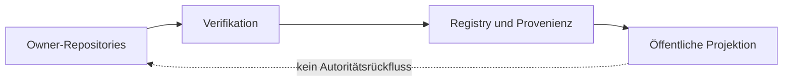

# Bootstrap-Materialisierungsnachweis — 29.08.2026

**Status:** PUBLIC PROJECTION EVIDENCE  
**Autorität:** keine aus sich selbst heraus  
**Quellengrundlage:** GitHub-Repository-Metadaten und Commit-Historie für `baum777/unitera_public_docs`, verifiziert am 29.08.2026

Dieser Nachweis dokumentiert den initialen Bootstrap der öffentlichen Dokumentation nach Erstellung des Repositories.

## Remote-Status vor dem Follow-up

- Repository: `baum777/unitera_public_docs`
- Sichtbarkeit: öffentlich
- Default-Branch: `main`
- Verifizierter Bootstrap-Head: `62e5da0ded3877fa69ed35f94b710c7aaaaad869`

Der initiale Bootstrap begründete die Grenze der öffentlichen Projektion, Governance, Quelldisziplin, Mermaid-Konventionen, Architekturzusammenfassungen, Runtime-/Sicherheitszusammenfassungen, Registry-Publikationsfluss, Quellengrundlage, Glossar und den Current-State-Snapshot.

## Wichtige Einordnung

Der Bootstrap wurde direkt auf `main` geschrieben, bevor der damalige Follow-up-Branch existierte. Der spätere Pull Request schrieb diese Historie weder um noch zurück. Er ergänzte prüfbare Materialisierungsevidenz und den anschließenden Abgleich des aktuellen Stands.

## Autoritätsstatus

Die öffentliche Dokumentation bleibt der Owner-Autorität und verifizierten Registry-/Provenienzreferenzen nachgelagert.

