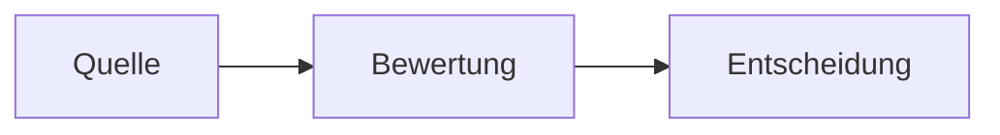
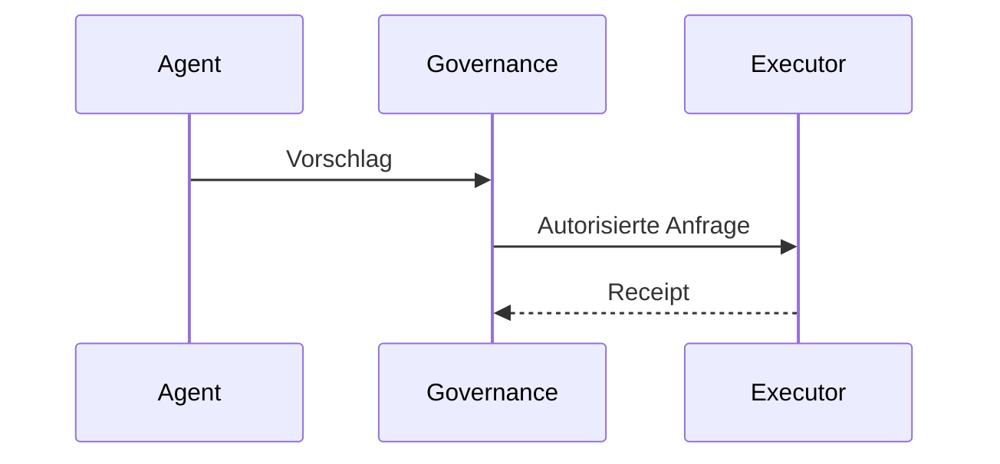

# Dokumentations- und Diagrammkonventionen

**Status:** lokale Publikationskonvention dieses Repositories  
**Autorität:** gilt ausschließlich für dieses öffentliche Projektions-Repository

## Dokumentkopf

Jede Architektur- oder Statusseite soll mit einer kompakten Statusdeklaration beginnen:

```text
Status: PUBLIC PROJECTION | ESTABLISHED | MATERIALIZED | CANDIDATE | OPEN
Authority: none by itself
Source basis: owning repo / frozen source / candidate source
```

`PUBLIC PROJECTION` beschreibt die Rolle des Dokuments. Es erhöht nicht den Reifegrad der darin beschriebenen Architektur.

## Technisches Vokabular

Kanonische technische Bezeichner und ihre Schreibweise bleiben erhalten:

- `UNITERA`
- `Unitera_Systems`
- `coreos`
- `unitera-os`
- `KNOW`
- `THINK`
- `ACT`
- `Company Brain`
- `Action Proposal`
- `Capability Request`
- `Capability Grant`
- `Receipt`
- `Verification`
- `email.send.commit`

Keine Aliasse für autoritätstragende Bezeichner erfinden.

## Mermaid-Konventionen

GitHub-natives Mermaid in Markdown verwenden.

### Flussdiagramme

Für Lifecycle- oder grenzüberschreitende Bewegungen `flowchart LR`, für geschichtete Architektur `flowchart TB` verwenden.



### Sequenzdiagramme

`sequenceDiagram` verwenden, wenn Reihenfolge der Akteure und Request-/Response-Semantik wesentlich sind.



### Grenznotation

- Durchgezogener Pfeil `-->`: normaler Daten- oder Kontrollfluss.
- Gepunkteter Pfeil `-.->`: erklärende Referenzbeziehung oder ausdrücklich beschriftetes Verbot des Autoritätsrückflusses.
- Subgraphs für KNOW/THINK/ACT oder klare Vertrauens-/Ownership-Domänen verwenden.
- Autorität, Risiko oder Reifegrad nicht allein durch Farbe codieren.

## Regeln für öffentliche Formulierungen

Bevorzugen:

- „abgeglichene Quellenrichtung“ statt „fertige Architektur“, solange die Adoption unvollständig ist;
- „Kandidat“, wenn die Quelle ausdrücklich `CANDIDATE` klassifiziert;
- „in der zuständigen Runtime materialisiert“ nur bei Verifikation;
- „Receipt“ und „Verification“ als getrennte Konzepte;
- „Registry-Referenz“ statt „Registry-Autorität“.

Unverifizierte Aussagen über Production Readiness, Compliance, Zertifizierung, Kundennachweis oder autonome Erlaubnis vermeiden.

