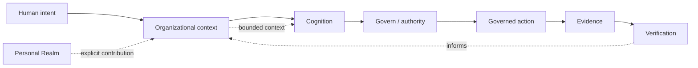

# UNITERA Public Docs

`UPD-START-001` · `ORIENTATION` · `PUBLIC_CORE`

> **The Architecture of Trusted Autonomy**  
> UNITERA connects organizational context, bounded cognition, human and institutional authority, governed effect and durable evidence without treating model capability as authority.



## Read the system first

The diagram is a **conceptual public projection**, not deployment, repository, protocol or security topology. Start with the [System Map](architecture/system-map.md) when you want to understand the boundaries and relationships rather than a page tree.

## Read by intent

<table data-view="cards"><thead><tr><th></th><th></th><th></th><th data-hidden data-card-target data-type="content-ref"></th></tr></thead><tbody>
<tr><td><strong>Understand UNITERA</strong></td><td>Build the mental model in a few minutes.</td><td>KNOW → THINK → Govern → ACT → PROVE</td><td><a href="getting-started/unitera-in-5-minutes.md">UNITERA in 5 minutes</a></td></tr>
<tr><td><strong>Trace the architecture</strong></td><td>Follow system layers, trust boundaries and runtime relations.</td><td>Cartography</td><td><a href="architecture/system-map.md">System Map</a></td></tr>
<tr><td><strong>Follow a real flow</strong></td><td>See how context, proposals, decisions and effects connect.</td><td>Flow</td><td><a href="getting-started/customer-request-from-a-to-z.md">Customer request A–Z</a></td></tr>
<tr><td><strong>Review governance</strong></td><td>Inspect public authority, disclosure and assurance semantics.</td><td>Governed instrument</td><td><a href="reference/governance.md">Governance</a></td></tr>
<tr><td><strong>Build / integrate</strong></td><td>Start from the public integration boundary without assuming unpublished APIs.</td><td>Developer entry</td><td><a href="build/README.md">Build / Integrate</a></td></tr>
</tbody></table>

## Current posture

The public documentation currently describes established core architecture, bounded implementations and an active path toward pilot readiness. It **does not claim production autonomy**. Use [Current public state](status/current-state.md) for the maintained maturity projection.

## Three reading modes

| Mode | Use it when you need to… | Primary surfaces |
|---|---|---|
| **Systems Cartography** | understand where something sits and what it touches | system map, architecture, boundaries, flows |
| **Knowledge Publication** | understand why something exists and how it works | concepts, specifications, build/reference |
| **Governed System Instrument** | inspect authority, gates, status, evidence and consequences | governance, maturity, assurance |

The sidebar is an index. The system relationships are the actual mental model.
