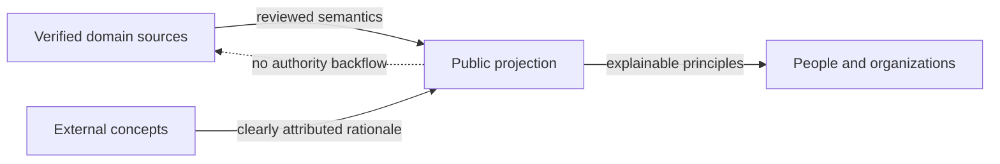

# Authority and source model

Status: `PUBLIC_ABSTRACTED`

Verified owner sources define domain truth. Public documentation explains that truth in reduced form and creates no authority of its own.

Candidates remain candidates. Publication is not adoption; adoption is not runtime activation. Exact source states are verified internally but are not published as an operational map.

> Conceptual public projection — not deployment, service, repository, protocol or security topology.
