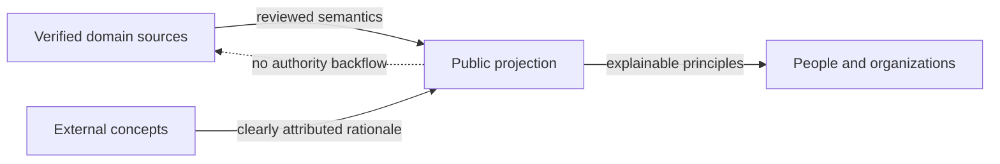
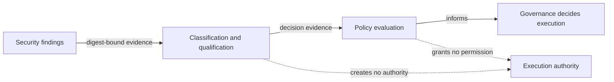

# Authority and source model

Status: `PUBLIC_ABSTRACTED`

Verified owner sources define domain truth. Public documentation explains that truth in reduced form and creates no authority of its own.

Candidates remain candidates. Publication is not adoption; adoption is not runtime activation. Exact source states are verified internally but are not published as an operational map.

## Security evaluation without execution authority

UNITERA separates security classification, evidence qualification and policy evaluation from execution authority.

Security findings can be compared against qualified historical evidence and evaluated deterministically, without treating a pre-existing finding as accepted risk. Ambiguous or unverifiable evidence fails closed and is reconciled explicitly instead of being rounded into false certainty.

Security evidence alone grants no runtime, tenant or business permission: an approved evaluation is not a capability grant, and a recorded receipt is not a verification of the business outcome.

This evaluation capability is established internally as a classification and qualification layer. Broader runtime or production enforcement exists only after separate owner authority and activation; it is not claimed by this documentation.

> Conceptual public projection — not deployment, service, repository, protocol or security topology.

---

[← Previous: Responsibility and trust domains](repository-topology.md) · [Index](../README.md) · [Next: KNOW / THINK / ACT →](know-think-act.md)
