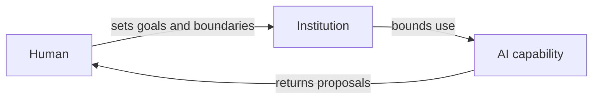
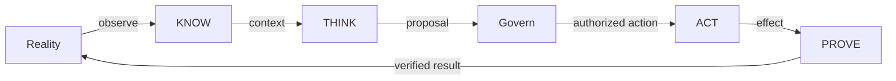
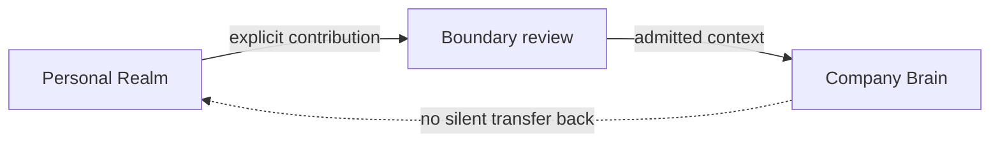
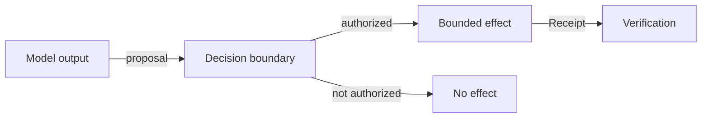
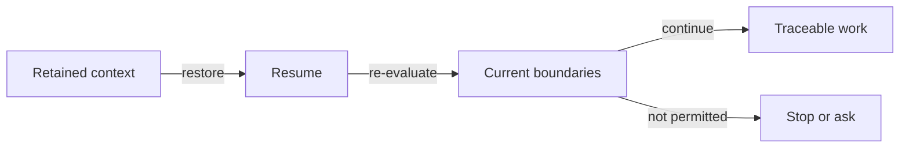

# Human Agency & Model Sovereignty

**Disclosure:** PUBLIC_CORE · PUBLIC_ABSTRACTED
**Adoption:** established semantics plus unadopted synthesis candidates
**Authority:** none by itself

UNITERA treats AI as an amplifying capability under human and institutional
decision sovereignty. Models may change; the boundaries of an action must not
change with them.

## Semantic classification

| Class | Public classification |
|---|---|
| Already established semantics | Context is not permission; model capability is not authority; receipt is not verification; personal and institutional continuity remain separate. |
| Externally supported rationale | Conceptual material supports the focus on human agency, durable institutions, and replaceable models. It is rationale, not UNITERA authority. |
| New adoption candidates | The unified Human Agency and Model Sovereignty framing and its coherent public narrative. |
| Open gaps | Formal adoption of the complete framing and full portability, recovery, and end-to-end qualification. |

The external rationale was derived from a supplied automatic transcript of the
public podcast episode
[“KI-Star Armin Ronacher: KI ist geil – aber die Blase wird platzen”](https://podcasts.apple.com/at/podcast/ki-star-armin-ronacher-ki-ist-geil-aber-die-blase-wird/id1896588425?i=1000787286885).
Episode metadata was resolved; inherited transcript anchors were not
independently rechecked.

## Human Agency

People set goals, boundaries, and binding decisions. Institutions define the
rules for their area of responsibility. AI assists within those boundaries.

> **Conceptual public projection — not deployment, service, repository, protocol or security topology.**

## The core loop

KNOW provides purpose-bound context. THINK analyzes and proposes. Govern checks
whether effect is permitted. ACT performs only an authorized effect. PROVE
separates execution evidence from outcome verification.

> **Conceptual public projection — not deployment, service, repository, protocol or security topology.**

## Personal and institutional boundary

The Personal Realm preserves personal continuity. The Company Brain holds
governed institutional context. Movement between them is a deliberate,
purpose-bound act, not automatic inheritance.

> **Conceptual public projection — not deployment, service, repository, protocol or security topology.**

## Governed Effect

Model output is a proposal. Binding effect arises only after a separate
authority check and remains reviewable through evidence and verification.

> **Conceptual public projection — not deployment, service, repository, protocol or security topology.**

## Resume Continuity

Resume means restoring traceable working context. It neither reactivates prior
permission nor creates new authority.

> **Conceptual public projection — not deployment, service, repository, protocol or security topology.**

## Claim boundary

This page exposes architectural principles and new adoption candidates. It does
not adopt invariants, activate governance, grant capabilities, or create runtime
or production effects.

---

[← Previous: Architecture and logic](architecture-and-logic-deep-dive.md) · [Index](../README.md) · [Next: Responsibility and trust domains →](repository-topology.md)
