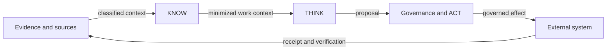

# KNOW / THINK / ACT

Status: `PUBLIC_CORE`

- **KNOW** supplies purpose-bound, current and traceable context.
- **THINK** analyzes, plans and produces proposals within external bounds.
- **ACT** evaluates authority and policy, controls real-world effects and produces evidence.

More context or model capability never creates more authority.

> Conceptual public projection — not deployment, service, repository, protocol or security topology.
