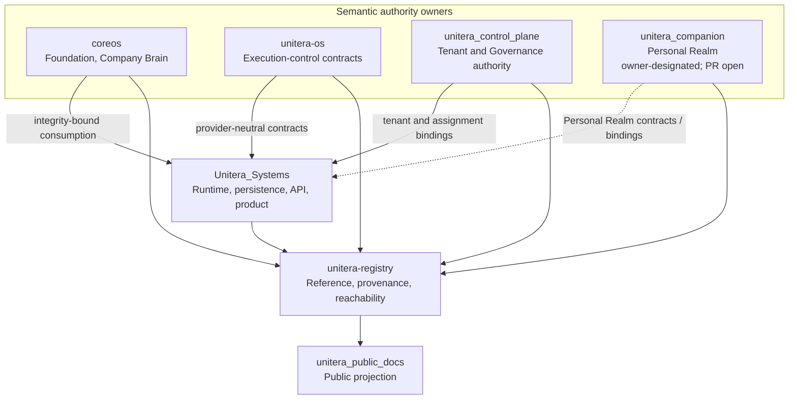
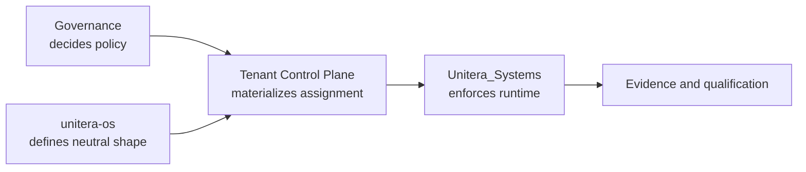

# Repository and Authority Topology

**Status:** PUBLIC PROJECTION  
**Authority:** none by itself  
**Source basis:** verified owner-repository `main` refs plus explicitly labeled qualified owner materialization in `PUBLICATION_MANIFEST.yaml`

UNITERA intentionally separates semantic authority, runtime implementation, provenance, and public communication.

## Ownership matrix

| Repository | Owns | Does not gain by implementation or indexing |
|---|---|---|
| `coreos` | Foundation, Company Brain, institutional context authority | Tenant-control or effect authority |
| `unitera-os` | Provider-neutral capability, autonomy, policy, grant, receipt, and execution-control contracts | Tenant assignment authority or product runtime ownership |
| `unitera_control_plane` | Tenant identity/lifecycle/ownership/membership authority; Governance policy and tenant-agent assignment materialization | Provider-neutral effect contracts or downstream runtime qualification |
| `unitera_companion` | Owner-designated Personal Realm semantics: Realm lifecycle/binding relationship, Companion, Personal Memory, Circling, personal ideation/planning, personal autonomy and recovery semantics. Current architecture materialization is on qualified PR #1, not yet owner `main`. | Person/PlatformPrincipal identity, Membership/Tenant authority, Company Brain, or provider-neutral execution authority |
| `Unitera_Systems` | Runtime enforcement, persistence, API, sessions, product surfaces, integrations, evidence persistence | Semantic ownership merely because it implements a contract |
| `unitera-registry` | Cross-repository references, provenance, adoption and implementation bindings, reachability checks | Authority, activation, tenant ownership, or execution permission |
| `unitera_public_docs` | Public explanation and diagrams | Any semantic, contract, runtime, tenant, or execution authority |

## Tenant-agent assignment split

The owner contract can be canonical while downstream runtime enforcement remains separately unqualified. **Runtime materialization ≠ semantic authority.**

## Registry relationship

Registry validation and reachability can prove that references resolve and conform. They cannot prove production behavior, activate a source, or confer permission.

## Personal Realm owner-surface status

The Personal Realm owner decision is finalized, but the current architecture foundation is still materialized on `unitera_companion/architecture/personal-realm-foundation@cb59971c` in PR #1. This public topology therefore treats the repository as the **owner-designated semantic surface** while keeping branch materialization distinct from a merged default-branch canonical state.
