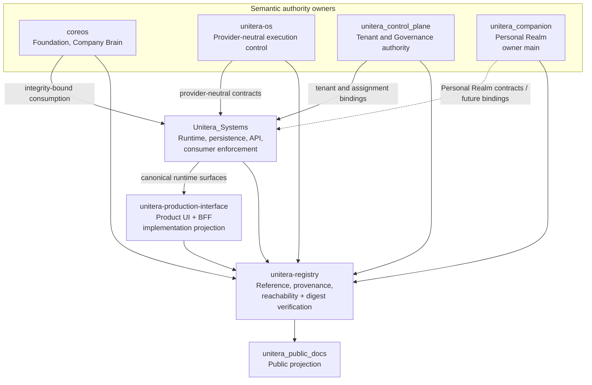
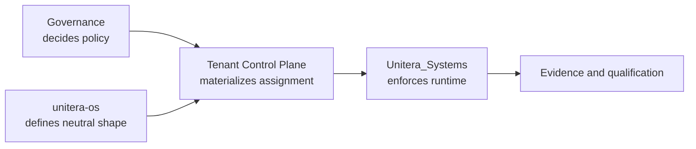

# Repository and Authority Topology

**Status:** PUBLIC PROJECTION  
**Authority:** none by itself  
**Source basis:** verified default-branch refs plus explicitly labeled qualified implementation/review refs in `PUBLICATION_MANIFEST.yaml`

UNITERA intentionally separates semantic authority, runtime implementation, product projection, provenance, and public communication.



## Ownership matrix

| Repository | Owns / materializes | Does not gain by implementation or indexing |
|---|---|---|
| `coreos` | Foundation, Company Brain, institutional context semantics | Tenant-control or effect authority |
| `unitera-os` | Provider-neutral Capability, autonomy, policy, Grant, Receipt and execution-control contracts | Tenant assignment authority or product-runtime ownership |
| `unitera_control_plane` | Tenant identity/lifecycle/ownership/membership authority; Governance policy and tenant-agent-assignment materialization | Provider-neutral effect contracts or downstream runtime qualification |
| `unitera_companion` | Personal Realm semantics: Realm lifecycle/binding relationship, Companion, Personal Memory, Circling, personal ideation/planning, personal autonomy and recovery semantics. The architecture foundation is now merged to owner `main@8dd8112`. | Person/PlatformPrincipal identity, Membership/Tenant authority, Company Brain, or provider-neutral execution authority |
| `Unitera_Systems` | Runtime enforcement, persistence, APIs, sessions, canonical product/runtime consumer surfaces, integrations and evidence persistence | Semantic ownership merely because it implements a contract |
| `unitera-production-interface` | Production Pilot Interface product UI + BFF; product-local Profile/Preferences and authority-safe projections | Tenant, Membership, Company Brain, Capability, Grant, Dispatch, Receipt, Verification or execution authority |
| `unitera-registry` | Cross-repository references, provenance, adoption/implementation bindings, reachability and digest-verification evidence | Authority, activation, tenant ownership, source adoption, or execution permission |
| `unitera_public_docs` | Public explanation and diagrams | Any semantic, contract, runtime, tenant, or execution authority |

## Tenant-agent assignment split



The owner contract can be canonical while a downstream conformance declaration remains separately open. **Runtime materialization != semantic authority.**

The current Registry freeze-readiness report specifically preserves this distinction: performed runtime qualification does not allow the Registry to override an owner contract that still records a different enforcement state.

## Product implementation split

The current project now has two distinct implementation surfaces that must not be conflated:

```text
Unitera_Systems
= canonical runtime / API / persistence / consumer enforcement surface

unitera-production-interface
= dedicated Production Pilot Interface
= browser product UI + small server-side BFF
```

The Production Interface consumes/adapts canonical surfaces. Its local schema and product state are implementation/projection concerns.

```text
Product UI exists
!= canonical authority exists locally

button enabled
!= Grant

product projection
!= Company Brain truth
```

Its merged Settings/Profile slice deliberately leaves Membership-role changes, invitation authority, Tenant mutation and Company-Brain mutation unavailable or projection-only. Production execution and live effects remain off.

## Qualified integration branches

Two important `Unitera_Systems` branches are visible in the public source basis without being upgraded to canonical main:

- Discovery PR #94 at `19e70f2`: 15 ahead / 0 behind `main`, qualified development slice.
- Pilot UI / identity / dual-control PR #98 at `903f025`: open, qualified integration in review; all five observed remote workflow families are successful at that exact head.

These branches can demonstrate implementation progress. They cannot create owner authority, source adoption, runtime activation or production permission merely by passing tests.

## Registry relationship

Registry validation, reachability and digest verification can prove that recorded references and bytes correspond to Git evidence. They cannot prove production behavior, activate a source, authorize a pilot, or confer permission.

The current Registry main `891f9b9` strengthens this integrity role by closing the RCC/digest-verification program without changing any owner authority or the source pointer.

## Personal Realm owner-surface status

The previous “PR open” description is superseded.

Personal Realm PR #1 is merged, and `unitera_companion/main@8dd8112` is the current owner-main architecture foundation.

Still separate:

```text
owner foundation merged
!= cross-repo adoption complete
!= runtime activated
!= production execution authorized
```
