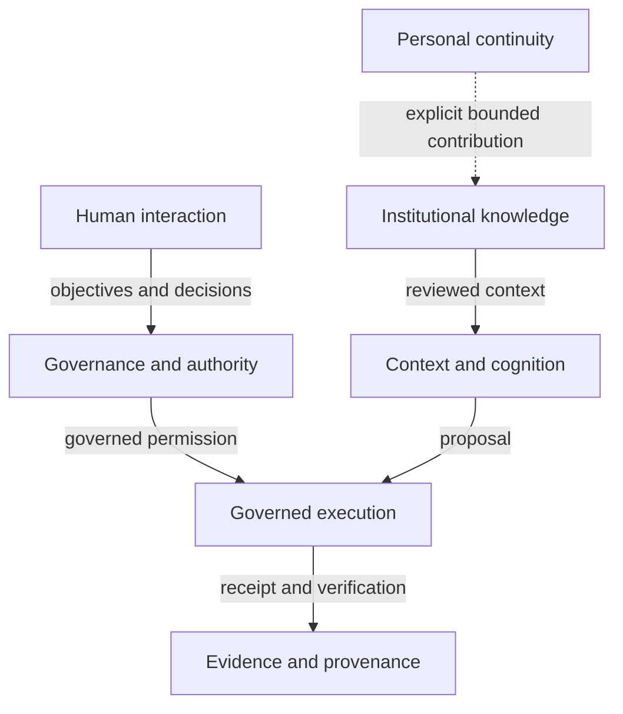

# Responsibility and trust domains

Status: `PUBLIC_ABSTRACTED`

The public architecture shows responsibility roles, not repository, service or deployment topology.

Physical allocation, internal contracts and enforcement chains remain in the responsible internal sources.

> Conceptual public projection — not deployment, service, repository, protocol or security topology.
